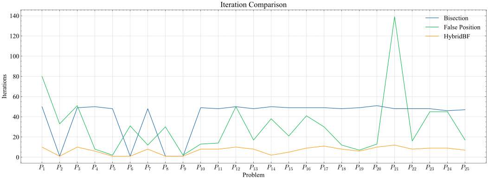
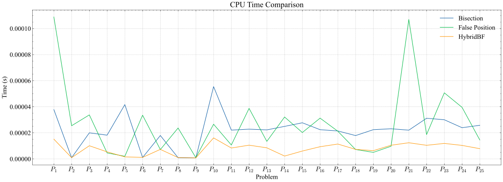
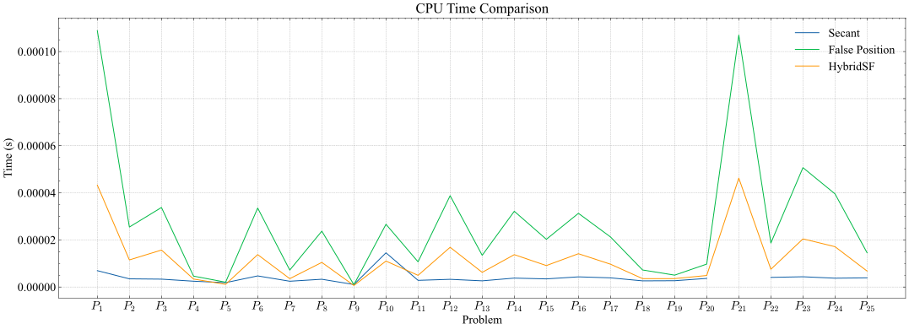
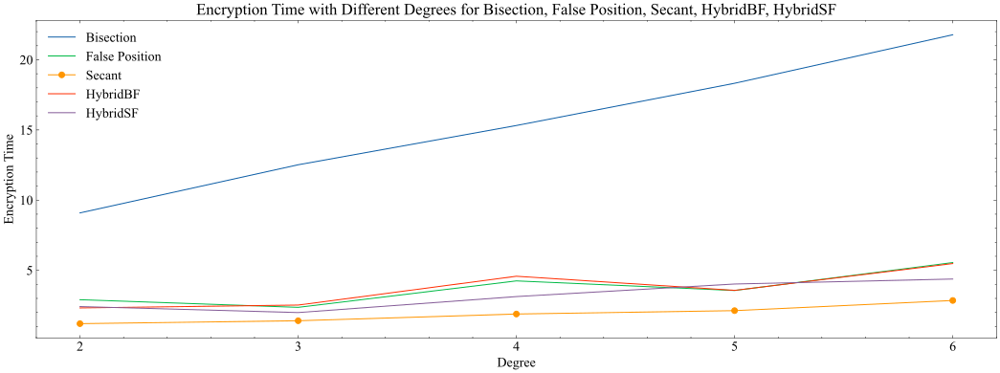
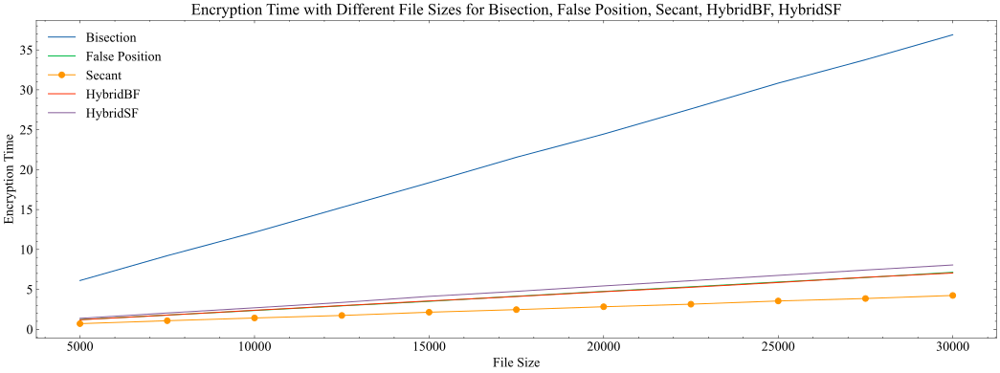
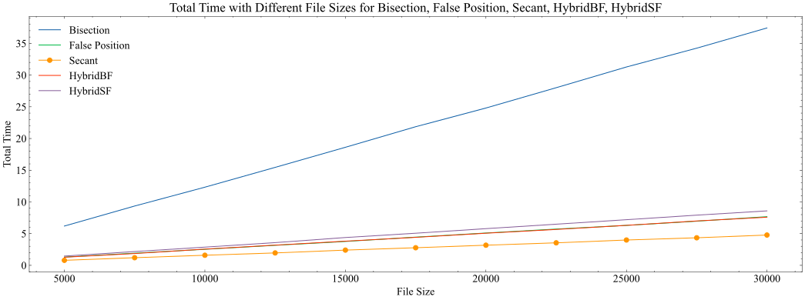
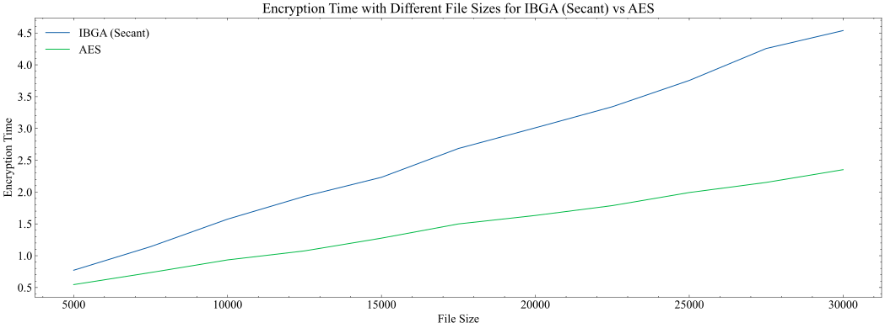
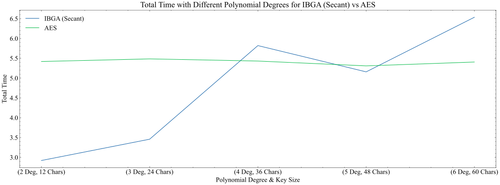

# High-Speed Encryption Algorithm Based on Polynomial Roots

This repository contains the implementation and evaluation of a novel high-speed encryption algorithm based on polynomial roots, developed as a graduation project for a Bachelor of Computers and Artificial Intelligence degree.

Read the full documentation [from here](https://drive.google.com/file/d/1yBrAiiDHxbMEDfqvyCZTEh7UV9rkd58I/view)

## Project Aim

The project aims to develop a high-speed encryption algorithm suitable for real-time applications. The algorithm is designed to encrypt and decrypt data at a significantly faster rate than traditional methods, such as AES.

## Overview

Traditional symmetric encryption methods often face challenges related to computational complexity and speed, which can hinder performance, especially in real-time applications. This project introduces the **IBGA Algorithm**, a novel encryption algorithm that leverages the mathematical properties of polynomials and root-finding methods to address these limitations.

The core idea is to transform plaintext data into integer representations, use a secret key to construct a unique polynomial function, and then find a root of that polynomial (potentially after some transformation involving the plaintext value) to serve as the ciphertext. Decryption involves using the same key to reconstruct the polynomial and evaluate it at the ciphertext root to recover the original plaintext integer value.

The project explores various root-finding algorithms to find the most efficient method for the encryption process and compares the performance of the IBGA algorithm against the widely used AES algorithm.

## Key Features

- **IBGA:** Uses polynomial interpolation and root-finding for encryption/decryption.
- **Root Finding Integration:** Employs root-finding methods to derive the ciphertext from the polynomial and plaintext.
- **Performance Evaluation:** Comparative analysis against standard root-finding methods (Bisection, False Position, Secant, HybridBF, HybridSF) and the AES algorithm.

## Numerical Methods Explored

The project investigated several root-finding algorithms to optimize the encryption process. Root-finding methods are numerical techniques used to find the values of $x$ for which a function $f(x)$ equals zero.

### Bisection Method

A bracketing method that repeatedly divides an interval in half and selects the subinterval in which a root must lie. It is robust and guaranteed to converge, but often slow.

### False Position Method (Regula Falsi)

Another bracketing method that uses a linear interpolation between two points to approximate the root. It often converges faster than bisection but can sometimes be slow if one endpoint remains fixed.

### Secant Method

An open method that uses a succession of roots of secant lines to approximate the root. It generally converges faster than bisection and false position but is not guaranteed to converge.

### HybridBF Algorithm

A hybrid algorithm combining the Bisection and False Position methods. In each iteration, it applies both methods and chooses the root approximation that yields the smallest absolute function value.

### HybridSF Algorithm

Similar to HybridBF, but this algorithm combines the Secant and False Position methods.

### Performance Comparison of Root-Finding Algorithms

The HybridBF method generally showed fewer iterations and faster CPU times compared to standalone Bisection and False Position methods. The Secant method was often the fastest in terms of CPU time and iterations among all tested methods, though HybridSF showed competitive performance in some scenarios. However, Secant is not guaranteed to converge for all problems.

- Iterations Comparison Bisection, False Position, HybridBF
  
- CPU Time Comparison Bisection, False Position, HybridBF
  
- Function Value Comparison Bisection, False Position, HybridBF
  
- Iterations Comparison Secant, False Position, HybridSF
  
- CPU Time Comparison Secant, False Position, HybridSF
  
- Function Value Comparison Secant, False Position, HybridSF
  
- Iterations Comparison Secant, HybridBF
  
- CPU Time Comparison Secant, HybridBF
  
- Function Value Comparison Secant, HybridBF
  

## How IBGA Works

The IBGA (Interpolation Based Genetic Algorithm - though the "Genetic Algorithm" part might be a misnomer if not used, the core is polynomial interpolation and root-finding) algorithm encrypts and decrypts data in chunks.

**Encryption:**

1.  Plaintext message is divided into chunks (e.g., 10 characters).
2.  Each chunk is converted into an integer representation (e.g., using ASCII values).
3.  A secret key (consisting of `x1`, `x2`, `y`, `s`, and `r` parameters) is used to generate a set of points.
    - `x1`, `x2`: Define the x-interval for polynomial points.
    - `y`: Defines the y-interval (e.g., `[y, -y]`) for polynomial points.
    - `s`: Number of sections to divide intervals, affecting polynomial degree.
    - `r`: Random seed for generating point variations.
4.  Newton's Forward Difference interpolation is applied to these points to generate a polynomial $P(x)$.
5.  The integer plaintext chunk ($T$) is normalized to a range like $[-1, 1]$ to get $T'$
6.  A new polynomial $P_{new}(x)$ is created by subtracting the normalized plaintext value from the generated polynomial: $P_{new}(x) = P(x) - T'$.
7.  A root of $P_{new}(x)$ is found using a selected root-finding method (e.g., Secant). This root is the ciphertext chunk.
8.  Ciphertext chunks are appended to form the full ciphertext.

**Decryption:**

1.  The ciphertext (a series of roots) and the secret key are taken as input.
2.  The polynomial $P(x)$ is regenerated using the same key and interpolation steps as in encryption.
3.  For each ciphertext chunk (which is a root, let's call it $c_i$), substitute it back into the polynomial $P(x)$ to get the normalized plaintext value: $T'_i = P(c_i)$.
4.  This normalized value $T'_i$ is denormalized to obtain the original integer plaintext chunk $T_i$:
    $ T_i = (T^{'}\_i \times (\text{max_val} - \text{min_val})) + \text{min_val} $ (assuming $T'$ was originally scaled from [0,1] before mapping to [-1,1] or similar).
5.  The integer chunk $T_i$ is converted back into its character representation.
6.  Plaintext chunks are combined to recover the original message.

## Performance Insights (IBGA Algorithm)

The evaluation compared the performance of the IBGA algorithm using different root-finding methods and against the AES algorithm across varying text sizes and polynomial degrees.

### IBGA with Different Root-Finding Methods

For the IBGA algorithm itself, the Secant method generally provided the fastest encryption times due to its efficiency in root finding. Decryption time is largely independent of the root-finding method used for encryption, as it primarily involves polynomial evaluation.

- Root Finding Algorithms Encryption Time With Different Degrees
  
- Root Finding Algorithms Decryption Time With Different Degrees
  
- Root Finding Algorithms Total Time With Different Degrees
  
- Root Finding Algorithms Encryption Time With Different File Sizes
  
- Root Finding Algorithms Decryption Time With Different File Sizes
  
- Root Finding Algorithms Total Time With Different File Sizes
  

### IBGA vs. AES

- The IBGA algorithm (using Secant for root-finding) exhibited **significantly faster decryption times** compared to AES. This is due to the direct polynomial evaluation process used in IBGA decryption, which is computationally less intensive than AES decryption.
- The IBGA algorithm's **total time (encryption + decryption) was also faster** than AES across evaluated text sizes and polynomial degrees.
- The IBGA algorithm was **slower in encryption time** compared to AES. This is attributed to the complexity of the polynomial interpolation and root-finding steps involved in the encryption process.

These results highlight that while the polynomial interpolation and root-finding add overhead during encryption, the efficiency gained in the decryption phase leads to a faster overall process compared to AES for the tested scenarios.

- Encryption Time Comparison (IBGA (Secant) vs AES, Different File Sizes)
  
- Decryption Time Comparison (IBGA (Secant) vs AES, Different File Sizes)
  
- Total Time Comparison (IBGA (Secant) vs AES, Different File Sizes)
  
- Encryption Time Comparison (IBGA (Secant) vs AES, Different Polynomial Degrees & Key Size)
  
- Decryption Time Comparison (IBGA (Secant) vs AES, Different Polynomial Degrees & Key Size)
  
- Total Time Comparison (IBGA (Secant) vs AES, Different Polynomial Degrees & Key Size)
  

## Implementation

The algorithm was implemented in Python for performance testing and evaluation.

## Technologies Used

- **Languages:** Python, JavaScript, HTML5, CSS3
- **Python Libraries:** `pandas`, `matplotlib`, `numpy`, `scienceplots`, `scipy`, `time`, `string`, `random`, `os`, `decimal`
- **JavaScript Libraries/Frameworks:** React, Node.js, Stream.js
- **Tools:** Visual Studio Code, Git, GitHub, Markdown, Mermaid, Pandoc

## Acknowledgements

This project was developed by the following team:

- Mohamed Ahmed Elsayed Emary
- Abdelfattah Zakaria Abdelfattah Morsy
- Mohamed Abdelfattah Ahmed Abdelfattah
- Sara Reda Abdallah Elsheikh
- Dalia Abdallah Mohamed Mahmoud
- Shrouk Elsayed Mohamed Abdelmoneim

Under the supervision of **Dr. El-sayed Badr** from the Faculty of Computers & Artificial Intelligence, Benha University. We are deeply grateful for his invaluable guidance and support.
