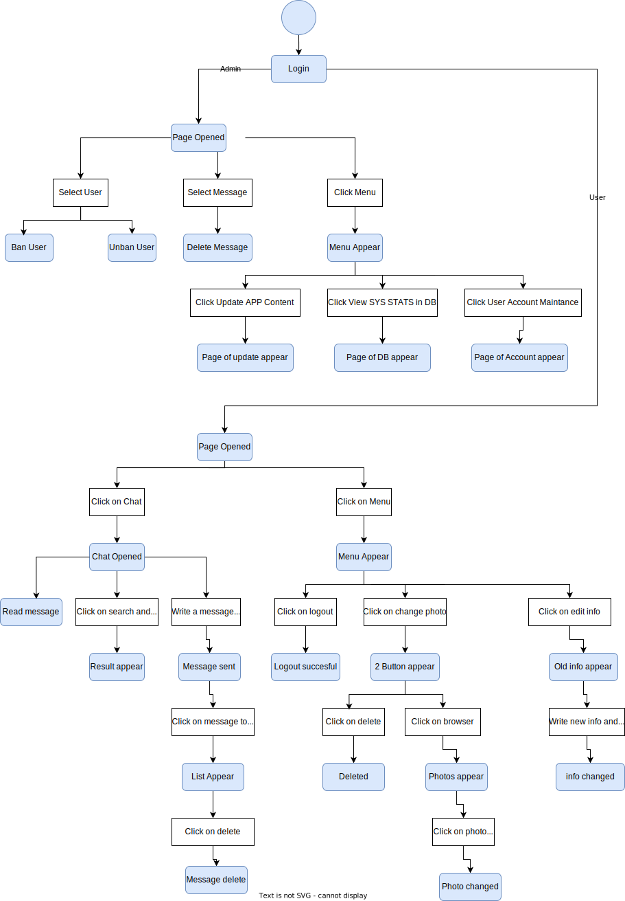

\pagebreak

# Introduction

The ever-evolving landscape of cyber threats demands constant innovation in the field of cryptography. Existing encryption algorithms, while providing valuable protection, are often riddled with limitations. Computational complexity can hinder performance, and the rise of quantum computing casts a shadow on the future of established methods. This project presents a groundbreaking departure from tradition, introducing a novel encryption algorithm that leverages the potent combination of polynomials and root finding methods.

This paper delves into the intricate details of the algorithm, meticulously explaining each step of the encryption and decryption processes. We provide a comprehensive analysis of its performance, Comparing it with established methods such as AES, showcasing its significant speed advantage.

\pagebreak

# Problem & Project Aim

Encryption, regardless of its application, inevitably requires some processing time. This could be for file encryption on a disk or network encryption via a VPN. The extent of this slowdown is contingent on the encryption algorithms employed and, crucially, the proficiency of the programmer who crafted the encryption and decryption code.

Algorithms with high computational complexity can become performance bottlenecks, particularly for systems necessitating real-time data encryption and decryption. This can adversely affect real-time applications such as video conferencing, secure voice calls, or high-speed data transfers. The processing delays induced by encryption can result in lag, disruptions, and a bad user experience.

The aim of this project is to develop a high-speed encryption algorithm that can be used for real-time applications. The algorithm should be able to encrypt and decrypt data at a much faster rate than traditional encryption algorithms, then it will be used to encrypt and decrypt data in real-time messaging web application.

\pagebreak

# Root Finding Methods

At the heart of our innovative encryption algorithm lies a powerful mathematical tool: root finding methods. These methods, while seemingly abstract, play a crucial role in ensuring the security and efficiency of our solution. But before we delve into their specific application, let's unpack what they are and why they hold such significance.

In essence, root finding methods aim to solve the equation $f(x) = 0$, where $f(x)$ is any function. They essentially seek the "roots" of the function, which are the values of $x$ that make the function evaluate to zero. This seemingly simple task becomes incredibly powerful in cryptography.

In our algorithm, we leverage this power by strategically designing the function $f(x)$ to incorporate the encryption key as an unknown variable. Through carefully chosen root finding methods, we iteratively approach the function's roots, and in the decryption process, utilize these roots to recover the original data. The elegance of this approach lies in its inherent security: without knowledge of both the root finding method and how the key is embedded within the function, an attacker would face a near-impossible task of finding the correct roots, keeping your data safe.

However, the importance of root finding methods extends far beyond encryption. They have diverse applications across various fields. In numerical analysis, they are used for solving differential equations and optimization problems among other things. In engineering design, they are crucial for calculating parameters in fields like fluid dynamics and structural analysis. In computer graphics, they are essential for generating realistic images and animations.

Root finding algorithms also have a significant role in machine learning. They are utilized in optimization methods like gradient descent, which is a common technique for training models. The goal of these methods is to minimize a loss function, thereby improving the model's accuracy.

They also have a vital role in economics and finance. They are used to calculate internal rates of return, solve equilibrium equations in economic models, and find optimal investment strategies.

And finally, we will be using root finding methods to solve the polynomial equations that we will be using in our encryption algorithm.

\pagebreak

# Bisection Method

The Bisection Method is a straightforward and reliable numerical method used for solving equations in mathematics, particularly in the field of engineering. It solves equations by repeatedly bisecting an interval and then selecting a subinterval in which a root must lie for further processing.

## How Does the Bisection Method Work?

If we have a function $f(x)$ that is continuous on the interval $[a, b]$ and $f(a) \cdot f(b) < 0$ (the signals of $f(x)$ at the ends $a$ and $b$ are different), then the function has at least one root in the interval $[a, b]$. The Bisection Method works by repeatedly bisecting the interval and then selecting a subinterval in which a root must lie for further processing. The value of $x$ at the midpoint of the interval is equal to $\frac{a+b}{2}$, if $f(\frac{a+b}{2}) = 0$, then $\frac{a+b}{2}$ is the root of the equation. If $f(a) \cdot f(\frac{a+b}{2}) < 0$, then the root lies in the interval $[a, \frac{a+b}{2}]$, and if $f(\frac{a+b}{2}) \cdot f(b) < 0$, then the root lies in the interval $[\frac{a+b}{2}, b]$. This process is repeated until we reach the desired accuracy.

The number of iterations required to reach the desired accuracy can be calculated using the formula:

$$n = \lceil\log_2(\frac{b-a}{\epsilon})\rceil$$

Where $n$ is the number of iterations, $a$ and $b$ are the lower and upper bounds of the interval, and $\epsilon$ is the desired accuracy.

The accuracy of the Bisection Method can be calculated using the formula:

$$\epsilon = \frac{b-a}{2^{n}}$$

## Bisection Method Advantages

There are several key advantages to the bisection method:

- Guaranteed convergence. The bracketing approach is known as the bisection method, and it is always convergent.

- Errors can be managed. Increasing the number of iterations in the bisection method always results in a more accurate root.

- Doesn't demand complicated calculations. There are no complicated calculations required when using the bisection method. To use the bisection method, we only need to take the average of two values.

- The bisection method is simple and straightforward to programme on a computer.

- In the case of several roots, the bisection procedure is quick.

## Bisection Method Disadvantages

There are also some limitations to the bisection method:

- Although the Bisection method's convergence is guaranteed, it is often slow.

- Choosing a guess that is close to the root may necessitate numerous iterations to converge.

- Some equations' roots cannot be found. Because there are no bracketing values, like $f(x) = x^2$.

- Its rate of convergence is linear.

- It is incapable of determining complex roots.

- If the guess interval contains discontinuities, it cannot be used.

- It cannot be applied over an interval where the function returns values of the same sign.

# False Position Method

In mathematics, the regula falsi, method of false position, or false position method is a very old method for solving an equation with one unknown; this method, in modified form, is still in use. In simple terms, the method is the trial and error technique of using test ("false") values for the variable and then adjusting the test value according to the outcome. This is sometimes also referred to as "guess and check". Versions of the method predate the advent of algebra and the use of equations.

## How Does the False Position Method Work?

If we have a function $f(x)$ that is continuous on the interval $[a, b]$ and $f(a) \cdot f(b) < 0$ (the signals of $f(x)$ at the ends $a$ and $b$ are different), then the function has at least one root in the interval $[a, b]$.

The interval $[a, b]$ have different signs. The false position method uses two endpoints of the interval $[a, b]$ with initial values $\left(r_{0}=a, r_{1}=b\right)$. The connecting line between the two points $\left(r_{0}, f\left(r_{0}\right)\right)$ and $\left(r_{1}, f\left(r_{1}\right)\right)$ intersects the $x$-axis at the next estimate, $r_{2}$. Now, we can determine the successive estimates, $r_{n}$ from the following relationship:

$$
r_{n}=r_{n-1}-\frac{f\left(r_{n-1}\right)\left(r_{n-1}-r_{n-2}\right)}{f\left(r_{n-1}\right)-f\left(r_{n-2}\right)}
$$

## False Position Method Advantages

There are several key advantages to the false position method:

- Convergence is guarenteed: this method is bracketing method and it is always convergent.

- Error can be controlled: increasing number of iteration always yields more accurate root.

- Does not require derivative: this method does not require derivative calculation.

## False Position Method Disadvantages

There are also some limitations to the false position method:

- Slow Rate of Convergence: Although convergence of Regula Falsi method is guaranteed, it is generally slow.

- Can not find root of some equations. For example: $f(x) = x^2$ as there are no bracketing values.

- It has linear rate of convergence.

- It fails to determine complex roots.

- It can not be applied if there are discontinuities in the guess interval.

- It can not be applied over an interval where the function takes values of the same sign.

# HybridBF Algorithm

The HybridBF algorithm is a hybrid algorithm between the bisection method and false position method. The algorithm works as follows:

1. Take the polynomial and the interval that contains the root.
2. In each iteration, the algorithm will apply the bisection method and the false position method and get the root from each method.
3. The algorithm will choose the root that will give the smallest absolute value of the polynomial.
4. The algorithm will stop when the absolute value of the polynomial is less than a certain tolerance we define.

```{.mermaid caption="HybridBF Steps Flowchart" width=35%}
graph TB
    Start(Start) --> Input[Input: Polynomial, Interval]
    Input --> Bisection[Apply Bisection Method]
    Input --> FalsePosition[Apply False Position Method]
    Bisection --> RootBisection[Root from Bisection]
    FalsePosition --> RootFalsePosition[Root from False Position]
    RootBisection --> Compare[Compare Absolute Values]
    RootFalsePosition --> Compare
    Compare --> Output[Output: Root with Smallest Absolute Value]
    Output --> Check{Check: Absolute Value < Tolerance?}
    Check -- Yes --> End(End)
    Check -- No --> Input
```

To test the algorithm we have used the same 25 equations with each method and run each method (Bisection, False Position, and Hybrid) 500 times for each problem and then we have calculated the average time. We have also calculated the number of iterations each method have taken for each problem.

We have also used the same tolerance for each method which is $10^{-14}$

These are the equations that we have used with each method:

## Equations That Serve as Test Cases

In these equations we have tried to use different types of functions like polynomial, exponential, trigonometric, and logarithmic functions to ensure that the algorithm works with different types of functions. We have also used different intervals with each algorithm depending on where the roots of the equations are.

Table: Test Cases Equations

|  No   | Equation                   |  Interval       |
| :---: | :------------------------- |  :------------- |
| $P1$  | $f(x) = x^{3}+4x^{2}-10=0$ |  $[0, 4]$       |
| $P2$  | $f(x)=x^2-4$               |  $[0, 4]$       |
| $P3$  | $f(x)=e^x-2$               |  $[0, 2]$       |
| $P4$  | $f(x)=\sin(x)$             |  $[2, 6]$       |
| $P5$  | $f(x)=x^3-6x^2+11x-6$      |  $[1, 2.5]$     |
| $P6$  | $f(x)=x^2+3x+2$            |  $[-2.5, -1.5]$ |
| $P7$  | $f(x)=\cos(x)-x$           |  $[0, 1]$       |
| $P8$  | $f(x)=2^x-8$               |  $[2, 4]$        |
| $P9$  | $f(x)=\tan(x)$             |  $[-1, 1]$      |
| $P10$ | $f(x)=x^4-8x^3+18x^2-9x+1$ |  $[2, 4]$       |

## Extra Equations From Paper

We got these equations from [this paper](https://www.researchgate.net/publication/360883886_Novel_hybrid_algorithms_for_root_determining_using_advantages_of_open_methods_and_bracketing_methods) and we have used the same intervals too.

Table: Equations From Paper

|  No   | Equation                 | Interval  | Reference       |
| :---: | :----------------------- | :-------- | :-------------- |
| $P11$ | $f(x)=x^2-3$             | $[1,2]$   | Harder [18]     |
| $P12$ | $f(x)=x^2-5$             | $[2,7]$   | Srivastava[9]   |
| $P13$ | $f(x)=x^2-10$            | $[3,4]$   | Harder [18]     |
| $P14$ | $f(x)=x^2-x-2$           | $[1,4]$   | Moazzam [10]    |
| $P15$ | $f(x)=x^2+2x-7$          | $[1,3]$   | Nayak[11]       |
| $P16$ | $f(x)=x^3-2$             | $[0,2]$   | Harder [18]     |
| $P17$ | $f(x)=xe^x-7$            | $[0,2]$   | Callhoun [19]   |
| $P18$ | $f(x)=x-\cos(x)$         | $[0,1]$   | Ehiwario [6]    |
| $P19$ | $f(x)=x\sin(x)-1$        | $[0,2]$   | Mathews [20]    |
| $P20$ | $f(x)=x\cos(x)+1$        | $[-2,4]$  | Esfandiari [21] |
| $P21$ | $f(x)=x^{10}-1$          | $[0,1.3]$ | Chapra [17]     |
| $P22$ | $f(x)=x^2+e^{x/2}-5$     | $[1,2]$   | Esfandiari [21] |
| $P23$ | $f(x)=\sin(x)\sinh(x)+1$ | $[3,4]$   | Esfandiari [21] |
| $P24$ | $f(x)=e^x-3x-2$          | $[2,3]$   | Hoffman [22]    |
| $P25$ | $f(x)=\sin(x)-x^2$       | $[0.5,1]$ | Chapra[17]      |

# Root Finding Algorithms Performance Results

These are the results we got with each method. We have run each method 500 times on each equation and took the average time to get the highest accuracy possible.

## False Position

These are the results we got with False Position method:

<!-- \fontsize{5}{12}\selectfont -->
\begin{scriptsize}
\begin{longtable}{ccccccc}
    \caption{False Position} \\
    \toprule
    \multirow{2}[4]{*}{\textbf{Problem}} & \multicolumn{6}{c}{\textbf{False Position Algorithm}} \\
    \cmidrule{2-7}
    & \textbf{Iter} & \textbf{Avg CPU Time} & \textbf{Approximate Root} & \textbf{Function Value} & \textbf{Lower Bound} & \textbf{Upper Bound} \\
    \midrule
    \endfirsthead
    \toprule
    \multirow{2}[4]{*}{\textbf{Problem}} & \multicolumn{6}{c}{\textbf{False Position Algorithm}} \\
    \cmidrule{2-7}
    & \textbf{Iter} & \textbf{Avg CPU Time} & \textbf{Approximate Root} & \textbf{Function Value} & \textbf{Lower Bound} & \textbf{Upper Bound} \\
    \midrule
    \endhead
    \hline
    \endfoot
    \bottomrule
    \endlastfoot
    $P1$ & 80     & 0.000229008 & 1.3652300134140964 & -7.11E-15 & 1.3652300134140964 & 4 \\
    $P2$ & 33     & 4.399728775024414e-05 & 1.9999999999999978 & -8.88E-15 & 1.9999999999999978 & 4 \\
    $P3$ & 51     & 5.6000232696533204e-05 & 0.6931471805599422 & -6.22E-15 & 0.6931471805599422 & 2 \\
    $P4$ & 8      & 6.000041961669922e-06 & 3.141592653589793 & 1.2246467991473532e-16 & 3.141592653589793 & 3.1415926535899232 \\
    $P5$ & 2      & 0      & 1      & 0      & 1      & 2.5 \\
    $P6$ & 31     & 4.800844192504883e-05 & -2     & -5.33E-15 & -2.5   & -2 \\
    $P7$ & 12     & 1.101541519165039e-05 & 0.7390851332151551 & 9.2148511043888e-15 & 0.7390851332151551 & 1 \\
    $P8$ & 30     & 4.401159286499024e-05 & 2.9999999999999987 & -7.11E-15 & 2.9999999999999987 & 4 \\
    $P9$ & 2      & 1.991748809814453e-06 & 0      & 0      & 0      & 1 \\
    $P10$ & 13     & 4.0007591247558594e-05 & 3.1117486563092474 & 0      & 3.1117486563092474 & 3.1117486563092482 \\
    \hline
    $P11$ & 14     & 1.7997264862060548e-05 & 1.732050807568876 & -4.00E-15 & 1.732050807568876 & 2 \\
    $P12$ & 50     & 6.600427627563476e-05 & 2.2360679774997876 & -9.77E-15 & 2.2360679774997876 & 7 \\
    $P13$ & 17     & 2.2464752197265626e-05 & 3.162277660168379 & -1.78E-15 & 3.162277660168379 & 4 \\
    $P14$ & 38     & 5.301380157470703e-05 & 1.9999999999999971 & -8.66E-15 & 1.9999999999999971 & 4 \\
    $P15$ & 21     & 3.1998634338378904e-05 & 1.8284271247461896 & -2.66E-15 & 1.8284271247461896 & 3 \\
    $P16$ & 41     & 5.600643157958984e-05 & 1.2599210498948719 & -6.22E-15 & 1.2599210498948719 & 2 \\
    $P17$ & 30     & 3.40123176574707e-05 & 1.5243452049841437 & -7.99E-15 & 1.5243452049841437 & 2 \\
    $P18$ & 12     & 1.2005805969238282e-05 & 0.7390851332151551 & -9.21E-15 & 0.7390851332151551 & 1 \\
    $P19$ & 7      & 7.99846649169922e-06 & 1.1141571408719306 & 8.881784197001252e-16 & 1.0997501702946164 & 1.1141571408719306 \\
    $P20$ & 13     & 1.1332988739013672e-05 & 2.0739328090912146 & 7.771561172376096e-16 & 2.0739328090912146 & 2.5157197710146586 \\
    $P21$ & 139    & 0.000183961 & 0.9999999999999991 & -8.88E-15 & 0.9999999999999991 & 1.3 \\
    $P22$ & 16     & 3.3281803131103514e-05 & 1.6490135532979475 & -1.78E-15 & 1.6490135532979475 & 2 \\
    $P23$ & 45     & 7.994651794433594e-05 & 3.2215883990939416 & 6.328271240363392e-15 & 3.2215883990939416 & 4 \\
    $P24$ & 45     & 6.818151473999023e-05 & 2.1253934262332246 & -9.77E-15 & 2.1253934262332246 & 3 \\
    $P25$ & 17     & 2.703714370727539e-05 & 0.8767262153950554 & 7.882583474838611e-15 & 0.8767262153950554 & 1 \\
\end{longtable}
\end{scriptsize}

## Bisection Method

These are the results we got with Bisection method:

\begin{scriptsize}
\begin{longtable}{ccccccc}
    \caption{Bisection} \label{tab:addlabel} \\
    \toprule
    \multirow{2}[4]{*}{\textbf{Problem}} & \multicolumn{6}{c}{\textbf{Bisection Algorithm}} \\
    \cmidrule{2-7}
    & \textbf{Iter} & \textbf{Avg CPU Time} & \textbf{Approximate Root} & \textbf{Function Value} & \textbf{Lower Bound} & \textbf{Upper Bound} \\
    \midrule
    \endfirsthead
    \toprule
    \multirow{2}[4]{*}{\textbf{Problem}} & \multicolumn{6}{c}{\textbf{Bisection Algorithm}} \\
    \cmidrule{2-7}
    & \textbf{Iter} & \textbf{Avg CPU Time} & \textbf{Approximate Root} & \textbf{Function Value} & \textbf{Lower Bound} & \textbf{Upper Bound} \\
    \midrule
    \endhead
    \hline
    \endfoot
    \bottomrule
    \endlastfoot
    $P1$  & 50     & 7.303380966186524e-05 & 1.3652300134140951 & -2.84E-14 & 1.3652300134140916 & 1.3652300134140987 \\
    $P2$  & 1      & 0      & 2      & 0      & 0      & 4 \\
    $P3$  & 49     & 4.200363159179687e-05 & 0.6931471805599436 & -3.33E-15 & 0.6931471805599401 & 0.6931471805599472 \\
    $P4$  & 50     & 3.406333923339844e-05 & 3.141592653589793 & 1.2246467991473532e-16 & 3.1415926535897896 & 3.1415926535897967 \\
    $P5$  & 48     & 7.496118545532227e-05 & 2.0000000000000018 & 0      & 1.9999999999999964 & 2.000000000000007 \\
    $P6$  & 1      & 1.9011497497558594e-06 & -2     & 0      & -2.5   & -1.5 \\
    $P7$  & 48     & 3.201484680175781e-05 & 0.7390851332151591 & 2.55351295663786e-15 & 0.7390851332151556 & 0.7390851332151627 \\
    $P8$  & 1      & 1.9893646240234374e-06 & 3      & 0      & 2      & 4 \\
    $P9$  & 1      & 1.991748809814453e-06 & 0      & 0      & -1     & 1 \\
    $P10$ & 49     & 9.199857711791992e-05 & 3.111748656309249 & 1.0658141036401503e-14 & 3.1117486563092456 & 3.1117486563092527 \\
    \hline
    $P11$ & 48     & 4.000377655029297e-05 & 1.7320508075688785 & 4.440892098500626e-15 & 1.732050807568875 & 1.732050807568882 \\
    $P12$ & 50     & 3.901958465576172e-05 & 2.2360679774997854 & -1.95E-14 & 2.236067977499781 & 2.236067977 \\
    $P13$ & 48     & 3.7988662719726566e-05 & 3.1622776601683817 & 1.5987211554602254e-14 & 3.162277660168378 & 3.1622776601683853 \\
    $P14$ & 50     & 4.400014877319336e-05 & 1.9999999999999991 & -2.66E-15 & 1.9999999999999964 & 2.0000000000000018 \\
    $P15$ & 49     & 5.607509613037109e-05 & 1.828427124746188 & -1.15E-14 & 1.8284271247461845 & 1.8284271247461916 \\
    $P16$ & 49     & 3.8086414337158205e-05 & 1.2599210498948743 & 5.329070518200751e-15 & 1.2599210498948707 & 1.2599210498948779 \\
    $P17$ & 49     & 3.905820846557617e-05 & 1.5243452049841473 & 3.375077994860476e-14 & 1.5243452049841437 & 1.5243452049841508 \\
    $P18$ & 48     & 2.9998779296875e-05 & 0.7390851332151591 & -2.55E-15 & 0.7390851332151556 & 0.7390851332151627 \\
    $P19$ & 49     & 0.000136974 & 1.114157140871928 & -3.00E-15 & 1.1141571408719244 & 1.1141571408719315 \\
    $P20$ & 51     & 5.606412887573242e-05 & 2.0739328090912155 & -1.33E-15 & 2.073932809091213 & 2.073932809091218 \\
    $P21$ & 48     & 4.004716873168945e-05 & 1.000000000000001 & 1.1102230246251565e-14 & 0.9999999999999966 & 1.0000000000000058 \\
    $P22$ & 44     & 5.988311767578125e-05 & 1.649013553297948 & 0      & 1.6490135532978911 & 1.6490135532980048 \\
    $P23$ & 48     & 6.889772415161133e-05 & 3.2215883990939425 & -5.55E-15 & 3.221588399093939 & 3.221588399093946 \\
    $P24$ & 48     & 4.5994281768798825e-05 & 2.1253934262332272 & 5.329070518200751e-15 & 2.1253934262332237 & 2.125393426233231 \\
    $P25$ & 47     & 6.799602508544923e-05 & 0.8767262153950632 & -8.88E-16 & 0.8767262153950597 & 0.8767262153950668 \\
\end{longtable}
\end{scriptsize}

## Hybrid Method

These are the results we got with hybrid method:

\begin{scriptsize}
\begin{longtable}{ccccccc}
    \caption{Hybrid} \\
    \toprule
    \multirow{2}[4]{*}{\textbf{Problem}} & \multicolumn{6}{c}{\textbf{Hybrid Algorithm}} \\
    \cmidrule{2-7}
    & \textbf{Iter} & \textbf{Avg CPU Time} & \textbf{Approximate Root} & \textbf{Function Value} & \textbf{Lower Bound} & \textbf{Upper Bound} \\
    \midrule
    \endfirsthead % This marks the end of the header for the first page
    \toprule
    \multirow{2}[4]{*}{\textbf{Problem}} & \multicolumn{6}{c}{\textbf{Hybrid Algorithm}} \\
    \cmidrule{2-7}
    & \textbf{Iter} & \textbf{Avg CPU Time} & \textbf{Approximate Root} & \textbf{Function Value} & \textbf{Lower Bound} & \textbf{Upper Bound} \\
    \midrule
    \endhead % This marks the end of the header for the subsequent pages
    \hline
    \endfoot % This marks the end of the footer for the intermediate pages
    \bottomrule
    \endlastfoot % This marks the end of the footer for the last page
    $P1$ & 10     & 3.6006927490234375e-05 & 1.3652300134140964 & -7.11E-15 & 1.365230013413779 & 1.3675001980274413 \\
    $P2$ & 1      & 1.9969940185546874e-06 & 2      & 0      & 0      & 4 \\
    $P3$ & 10     & 1.399993896484375e-05 & 0.6931471805599453 & 0      & 0.6931471805599334 & 0.695162706 \\
    $P4$ & 6      & 1.006174087524414e-05 & 3.141592653589793 & 1.2246467991473532e-16 & 3.1415903579556947 & 3.141592653604888 \\
    $P5$ & 1      & 3.940105438232422e-06 & 1      & 0      & 1      & 2.5 \\
    $P6$ & 1      & 1.9888877868652345e-06 & -2     & 0      & -2.5   & -1.5 \\
    $P7$ & 8      & 1.1938095092773438e-05 & 0.7390851332151606 & 1.1102230246251565e-16 & 0.739085133 & 0.7422270732175922 \\
    $P8$ & 1      & 2.0036697387695312e-06 & 3      & 0      & 2      & 4 \\
    $P9$ & 1      & 2.0928382873535157e-06 & 0      & 0      & -1     & 1 \\
    $P10$ & 8      & 2.4066925048828126e-05 & 3.1117486563092474 & 0      & 3.1085379927858856 & 3.1117486563092536 \\
    \hline
    $P11$ & 8      & 1.7096519470214843e-05 & 1.7320508075688772 & -4.44E-16 & 1.7320508075688001 & 1.7350578402209837 \\
    $P12$ & 10     & 1.4061450958251953e-05 & 2.236067977499789 & -3.55E-15 & 2.236067977499364 & 2.243929153983615 \\
    $P13$ & 8      & 1.393747329711914e-05 & 3.1622776601683795 & 1.7763568394002505e-15 & 3.16227766 & 3.1672187190124017 \\
    $P14$ & 2      & 2.0089149475097657e-06 & 2      & 0      & 1.5    & 2.5 \\
    $P15$ & 5      & 8.056163787841797e-06 & 1.828427125 & 0      & 1.8284271247430004 & 1.8284271247493797 \\
    $P16$ & 9      & 1.2000083923339844e-05 & 1.2599210498948723 & -4.00E-15 & 1.259921049893984 & 1.2611286403176987 \\
    $P17$ & 11     & 1.3935565948486329e-05 & 1.5243452049841444 & 0      & 1.5243452049841386 & 1.526033337108763 \\
    $P18$ & 8      & 1.0064601898193359e-05 & 0.7390851332151606 & -1.11E-16 & 0.739085133 & 0.7422270732175922 \\
    $P19$ & 6      & 8.002758026123047e-06 & 1.1141571408719302 & 2.220446049250313e-16 & 1.1132427327642702 & 1.1141571408719768 \\
    $P20$ & 10     & 1.5938282012939452e-05 & 2.073932809091215 & -2.22E-16 & 2.0739328090911866 & 2.078935003337393 \\
    $P21$ & 12     & 1.6058921813964842e-05 & 0.9999999999999999 & -1.11E-15 & 0.9999999999999305 & 1.000343363282986 \\
    $P22$ & 8      & 2.393531799316406e-05 & 1.6490135532979473 & -3.55E-15 & 1.6490135532974015 & 1.6531560376633945 \\
    $P23$ & 9      & 1.7997264862060548e-05 & 3.221588399093942 & 3.3306690738754696e-16 & 3.2215883990939242 & 3.2224168881395068 \\
    $P24$ & 9      & 1.2019157409667969e-05 & 2.125393426233225 & -7.11E-15 & 2.1253934262325003 & 2.1275213330097245 \\
    $P25$ & 7      & 1.1998653411865234e-05 & 0.8767262153950581 & 4.773959005888173e-15 & 0.8767262153886713 & 0.8772684454348731 \\
\end{longtable}
\end{scriptsize}

As we see from the table above the hybrid method tend to be faster and take much less iterations than both Bisection and False Position methods.

## Conclusion

Our conclusions based on the tables and the plots are:

<!-- > *Side Note: The equation $f(x)=x^3-6x^2+11x-6$ in P5 has two roots. In the false position and hybrid methods, the equation has a root at 1. On the other hand,  the bisection method identifies another root at approximately 2.0000000000000018 within the interval $[1, 2.5]$.* -->

### Iterations


The hybrid method demonstrates superior performance compared to both the bisection and false position methods in terms of the number of iterations required.

As we see here in P21 the false position method have much more number of iterations than both hybrid and bisection methods which will lead to more CPU time as we will see in the next section.

### CPU Time


The hybrid method shows significant improvement over the bisection method in terms of CPU time, with a ratio of 21:4 .This translates to approximately 84% for the hybrid method and 16% for the bisection method.

The hybrid method shows significant improvement over the false position method in terms of CPU time, with a ratio of 19:6 .This translates to approximately 76% for the hybrid method and 24% for the false position method.

As a general trend, the hybrid method is faster than both the bisection and false position methods when it comes to finding the approximate root.

### Function Value


The hybrid method outperforms both the bisection and false position methods in terms of function value, with smaller values that are closer to zero.

<!-- 
---
title: \begin{title}\centering\vspace*{1cm}\rule{\textwidth}{0.05cm}\linebreak\vspace{0.5cm}{\huge\bfseries Polynomial Interpolation Based Encryption Algorithm \par}\vspace{0.1cm}\hrule\end{title}
date: February 8, 2024
abstract: Encryption algorithms are vital for securing sensitive data. However, many popular algorithms like AES have high computational costs. This paper proposes a new polynomial interpolation based encryption algorithm that aims to improve encryption and decryption speeds. After testing the algorithm against AES on 1000 different plaintext messages and keys, the results showed that the algorithm is much faster than AES in both encoding and decoding times.\pagebreak
--- 

\pagebreak
-->

\pagebreak

# Encryption Algorithm Steps

## Encryption Process

The algorithm encrypts plaintext message using a polynomial and root finding method to generate a ciphertext. The encryption process works as follows:

1. Take the plaintext message and convert each 4 characters to an integer value using their ASCII values.
2. Take the key from the user which will be used to generate the polynomial. The encryption key consists of a set of 5 integer values $x_1$, $x_2$, $y$, $s$, and $r$.
   1. $x_1$ and $x_2$ define $x$ interval for the polynomial.
   2. $y$ defines the start of $y$ interval for the polynomial and the end will be the negative of $y$ to ensure that the polynomial crosses the x-axis and has a root.
   3. $s$ defines the number of sections that we want to divide the interval into which will affect the degree of the polynomial.
   4. $r$ is used as a random state for the random number generator. The random values will always be the same for the same $r$ value.
3. Use the encryption key to generate points that will be used to generate the polynomial. The points are generated using the following steps:
   1. Divide the interval $[x_1, x_2]$ into $s$ equal sections.
   2. Divide the interval $[y, -y]$ into $s$ equal sections.
   3. Generate points from the two intervals that will be used to generate the polynomial.
   4. Use the random numbers we got $r$ to add some noise to the points.
   5. Apply Newton Forward Difference interpolation to the points to generate the polynomial Since the points are equally spaced.
4. Now we have the polynomial and the plaintext integer representation so we will subtract the plaintext integer from the polynomial representation
5. We get the root of the polynomial which will be the ciphertext using HybridBF algorithm which is a hybrid algorithm between the bisection method and false position method and it will be discussed later.

```{.mermaid caption="Encryption Steps Flowchart" width=25%}
graph TD
A[Start] --> B[Take plaintext message]
B --> C[Convert each 4 characters to an integer]
C --> D[Take the key from the user]
D --> E[Generate points using the key]
E --> F[Apply Newton Forward Difference interpolation to the points]
F --> G[Subtract plaintext integer from polynomial]
G --> H[Find root of polynomial]
H --> I[End: Root is the Ciphertext]
```

## Decryption Process

The algorithm decrypts the ciphertext message using the polynomial. The decryption process works as follows:

1. Take the ciphertext and the key from the user which will be used to generate the polynomial again.
2. Use the key to generate the polynomial using the same steps as the encryption process.
3. Now we have the polynomial and the ciphertext so we will substitute the ciphertext in the polynomial to get the plaintext integer representation.
4. Convert the integer representation to the plaintext message by converting each integer to 4 characters using their ASCII values.

```{.mermaid caption="Decryption Steps Flowchart" width=45%}
graph TD
A[Start] --> B[Take ciphertext and key from user]
B --> C[Generate polynomial using the key]
C --> D[Substitute ciphertext in polynomial and get the result]
D --> E[The result is the plaintext integer representation]
E --> F[Convert the integer to the plaintext message]
F --> G[End: Plaintext message]
```

# Results

The algorithm was tested using 1000 different plaintext messages and keys and was compared against AES encryption algorithm which is a symmetric encryption algorithm. The results showed that the algorithm is much faster than AES.

## Encode Time Comparison

The algorithm showed a significant improvement in the encoding time compared to AES. The encoding time was measured using the time library in python and the results are shown in this figure:


And when we sum the encoding time for all the 1000 messages we get the following results:

{width=350px}

## Decode Time Comparison

The algorithm have also showed a significant improvement in the decoding time compared to AES. The results are shown in this figure:


And when we sum the decoding time for all the 1000 messages we get the following results:

{width=350px}

## Total Time Comparison

The total time for both algorithms was also measured and compared. The results are shown in this figure:


And when we sum the total time for all the 1000 messages we get the following results:

{width=350px}

\pagebreak

# Design & Analysis

## Functional & Non-Functional Requirements Table

Table: Functional & NonFunctional Requirements

<!-- | ------------------ | :----------------: | :-------------------: | --------------------------------------------------------- | ------------ | ---------------- | -->

| Name           | Functional | NonFunctional | Description                                           | Priority | Actor    |
| ------------------ | :----------------: | :-------------------: | --------------------------------------------------------- | ------------ | ---------------- |
| Registration   |  $\checkmark$  |                   | Functionality to create account.                          | High         | User & Admin |
| Login          |  $\checkmark$  |                   | Functionality to get access.                              | High         | User & Admin |
| Logout         |  $\checkmark$  |                   | Functionality to delete session.                          | High         | User & Admin |
| Add Chat       |  $\checkmark$  |                   | Functionality for user to chat with other.                | Medium       | User         |
| Remove Chat    |  $\checkmark$  |                   | Functionality for user to remove chat.                    | Medium       | User         |
| Find Chat      |  $\checkmark$  |                   | Functionality for user to search for a chat.              | High         | User         |
| Block Account  |  $\checkmark$  |                   | Functionality for user to block user account.             | Medium       | User         |
| Send Message   |  $\checkmark$  |                   | Functionality that send message.                          | High         | User         |
| Delete Message |  $\checkmark$  |                   | Functionality to delete message.                          | Medium       | User & Admin |
| Read Message   |  $\checkmark$  |                   | Functionality for user to read message                    | High         | User         |
| Privacy        |                |   $\checkmark$    | Users privacy.                                            | High         | Admin        |
| Robustness     |                |   $\checkmark$    | to make able to deal with errors.                         | High         | Admin        |
| Performance    |                |   $\checkmark$    | Application performance must be better.                   | High         | Admin        |
| Usability      |                |   $\checkmark$    | To make able to use even for newbie.                      | High         | Admin        |
| Reliability    |                |   $\checkmark$    | To be trustworthy to users.                               | High         | Admin        |
| Supportability |                |   $\checkmark$    | To be capable of being supportive.                        | High         | Admin        |
| Portability    |                |   $\checkmark$    | Application must be able to run in many different system. | High         | Admin        |

## Use Case Diagram

{width=260px}

## Activity Diagram


## Class Diagram


## Sequence Diagram


## State Diagram




## Context Diagram


## Data Flow Diagram


## Entity Relationship Diagram


\pagebreak

# Future Work

After the successful implementation of the algorithm, we are planning to work on:

- Create a messaging application that uses the algorithm to secure the messages. The application will be a web application that will allow users to send and receive messages securely.

- The messaging application will feature end-to-end encryption, ensuring that only the intended recipient can read the messages. This is achieved by implementing our unique high-speed encryption algorithm.

- Users will be able to create an account, start conversations, and send send messages. Each message sent through the application is encrypted before it leaves the sender's device and can only be decrypted by the intended recipient. This ensures the privacy and security of the communication, even if the data is intercepted during transmission.

- The application will also include features such as group messaging, file sharing, and message notifications. The user interface will be intuitive and user-friendly, making it easy for users to navigate and use the application.

\pagebreak

# References

\doublespacing

1. jagpreet kaur, Dr. Ramkumar K.R.. A Cryptographic Algorithm using Polynomial Interpolations for Mitigating Key-Size Based Attacks, 14 September 2022, PREPRINT (Version 1) available at Research Square [https://doi.org/10.21203/rs.3.rs-2050151/v1]

2. Badr, El-Sayed & Attiya, Hala & El Ghamry, Abdallah. (2022). Novel hybrid algorithms for root determining using advantages of open methods and bracketing methods. Alexandria Engineering Journal. 61. 11579-11588. 10.1016/j.aej.2022.05.007.

3. Harder, D.W. Numerical Analysis for Engineering. Available online: <https://ece.uwaterloo.ca/~dwharder/nm/> (accessed on 11 June 2019).

4. Srivastava, R.B.; Srivastava, S. Comparison of numerical rate of convergence of bisection, Newton and secant methods. J. Chem. Biol. Phys. Sci. 2011, 2, 472–479.

5. Moazzam, G.; Chakraborty, A.; Bhuiyan, A. A robust method for solving transcendental equations. Int. J. Comput. Sci. Issues 2012, 9, 413–419.

6. Nayak, T.; Dash, T. Solution to quadratic equation using genetic algorithm. In Proceedings of the National Conference on AIRES-2012, Vishakhapatnam, India, 29–30 June 2012.

7. Calhoun, D. Available online: <https://www.boisestate.edu/math/>.

8. Ehiwario, J.C.; Aghamie, S.O. Comparative Study of Bisection, Newton-Raphson and Secant Methods of Root-Finding Problems. IOSR J. Eng. 2014, 4, 1–7

9. Mathews, J.H.; Fink, K.D. Numerical Methods Using Matlab, 4th ed.; Prentice-Hall Inc.: Upper Saddle River, NJ, USA, 2004; ISBN 0-13-065248-2.

10. Esfandiari, R.S. Numerical Methods for Engineers and Scientists Using MATLAB; CRC Press: Boca Raton, FL, USA, 2013.

11. Chapra, S.C.; Canale, R.P. Numerical Methods for Engineers, 7th ed.; McGraw-Hill: Boston, MA, USA, 2015.
