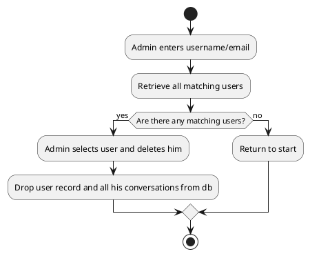

# Introduction

The polynomial interpolation based encryption algorithm is a new method for encrypting data. It is based polynomial interpolation & root finding methods, which is a mathematical technique for constructing new data points within the range of a discrete set of known data points. The algorithm is based on the idea of using a polynomial function to encrypt the data. The polynomial function is constructed using a set of known data points, and the encrypted data is then generated by evaluating the polynomial function at a new set of points. The algorithm is designed to be secure, efficient, and easy to implement. In this paper, we describe the algorithm in detail and present the results of some preliminary tests that we have conducted to evaluate its performance.

---

Energy Consumption: Slow encryption algorithms can consume more energy, especially in battery-powered devices such as mobile phones or IoT devices. This can lead to reduced battery life and increased operational costs.

Increased Processing Overhead: Slower encryption algorithms require more computational resources (such as CPU cycles and memory) to perform encryption and decryption operations. This increased processing overhead can strain system resources, leading to higher costs, reduced scalability, and potentially degraded user experience.

Impact on Real-Time Systems: In real-time systems where timely processing is critical (e.g., communication systems, financial transactions), slow encryption algorithms may introduce unacceptable delays, affecting the responsiveness and reliability of the system.

In large-scale deployments, the high computational demand of complex algorithms can contribute to increased energy consumption and carbon footprint. This poses ethical and environmental concerns.

---

Current Solutions in the Market:

- There are well-established encryption algorithms available, both symmetric and asymmetric, that have been extensively researched, tested, and proven secure.
- Symmetric encryption algorithms like AES (Advanced Encryption Standard) are widely used and offer good performance.
- Asymmetric encryption algorithms like RSA and ECC provide secure key exchange and other features but are generally slower than symmetric algorithms.
- Existing solutions also include cryptographic libraries and frameworks that provide implementations of various encryption algorithms, making it easier to integrate encryption into your application.
