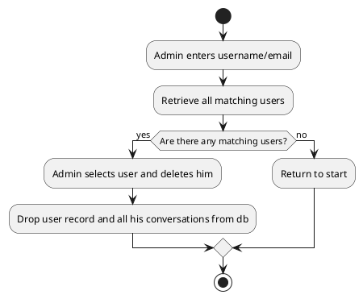

# Introduction

The polynomial interpolation based encryption algorithm is a new method for encrypting data. It is based polynomial interpolation & root finding methods, which is a mathematical technique for constructing new data points within the range of a discrete set of known data points. The algorithm is based on the idea of using a polynomial function to encrypt the data. The polynomial function is constructed using a set of known data points, and the encrypted data is then generated by evaluating the polynomial function at a new set of points. The algorithm is designed to be secure, efficient, and easy to implement. In this paper, we describe the algorithm in detail and present the results of some preliminary tests that we have conducted to evaluate its performance.

