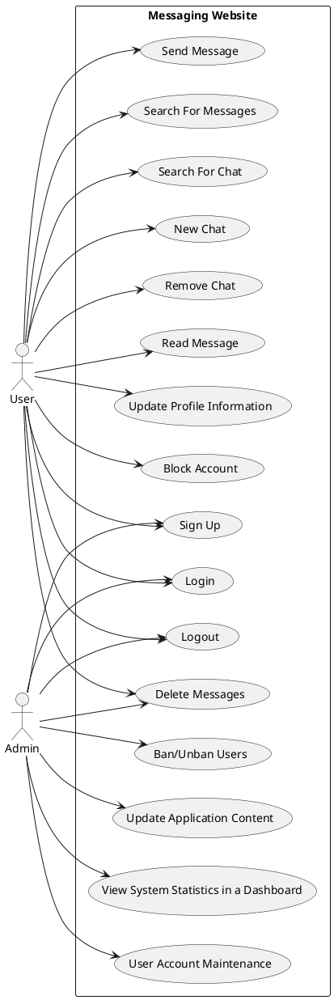

```plantuml
@startuml
left to right direction
actor User
actor Admin

rectangle "Messaging Website" {
    User --> (Sign Up)
    User --> (Login)
    User --> (Send Message)
    User --> (Search For Messages)
    User --> (Search For Chat)
    ' User --> (Chat List View)
    User --> (New Chat)
    User --> (Remove Chat)
    User --> (Delete Messages)
    User --> (Read Message)
    User --> (Update Profile Information)
    User --> (Logout)
    User --> (Block Account)

    Admin --> (Sign Up)
    Admin --> (Login)
    Admin --> (Ban/Unban Users)
    ' Admin --> (Delete Users)
    Admin --> (Delete Messages)
    Admin --> (Update Application Content)
    Admin --> (View System Statistics in a Dashboard)
    Admin --> (Logout)
    Admin --> (User Account Maintenance)
}
@enduml
```

<!-- Admin:
application development -->