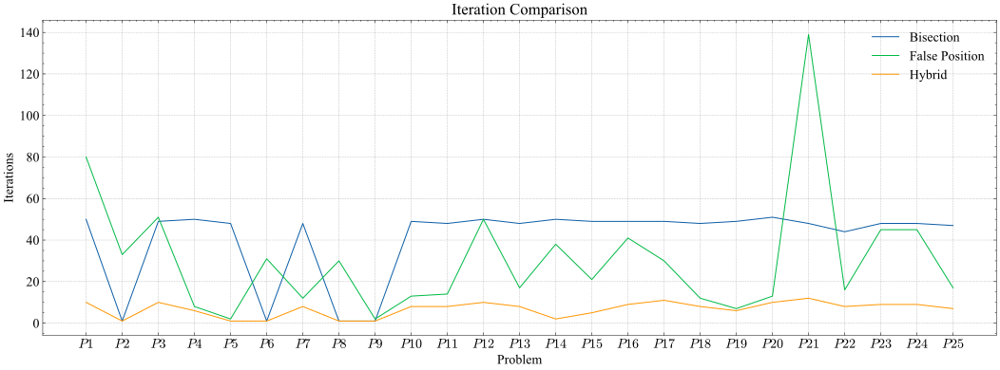
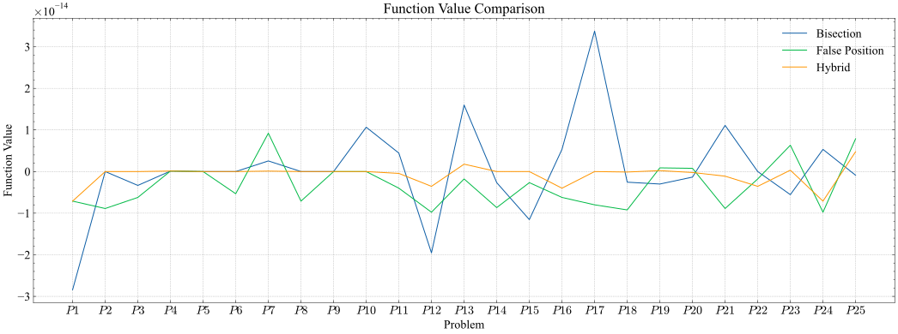
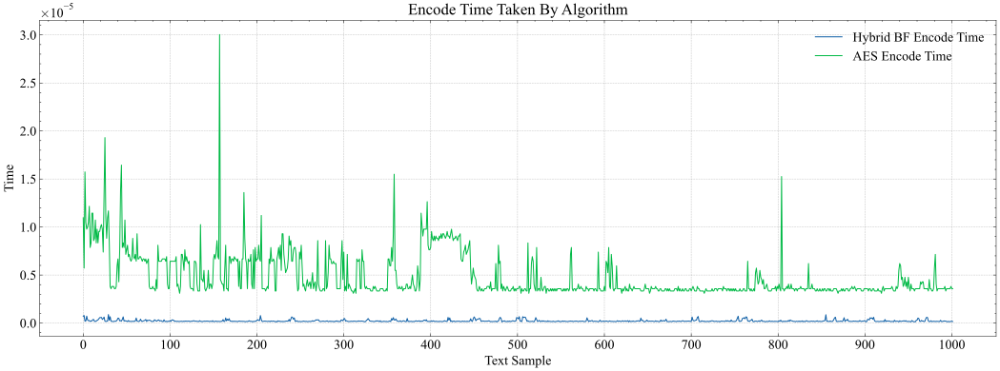
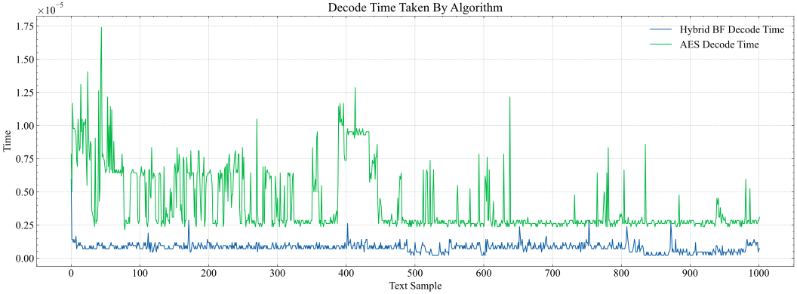
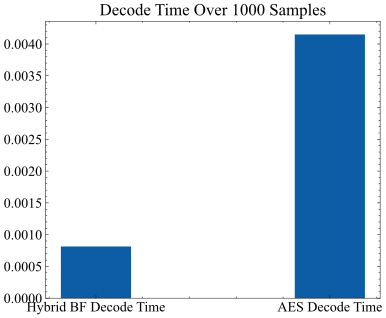

<!-- markdownlint-disable -->

<!-- 
_class: slide-one
-->

# Messaging Web Application Using High-Speed Encryption Algorithm with Polynomial Roots

---

# Team Members

- Mohamed Ahmed Elsayed
- Mohamed Abdelfattah Ahmed
- Abdelfattah Zakaria Abdelfattah
- Shrouk Elsayed Mohamed
- Dalia Abdallah Mohamed
- Sara Reda Abdallah

Under supervision of **Dr. Sayed Badr**

---

# Agenda

<!-- Order of list items -->

1. Problem
2. Current Solutions in the Market
3. Root Finding Algorithms
4. How Does The Encryption Algorithm Works
5. Results
6. Methodology
7. Current Progress
8. Future Work

<!-- 6. Project Aim -->

Let's get started!

---

# Problem

The current encryption algorithms are slow and consume a lot of energy, which is not suitable for real-time applications.

They can cause multiple problems like:

* Increased Processing Overhead
* Impact on Real-Time Systems
* Increased energy consumption and carbon footprint

---

## Increased Processing Overhead

Slower encryption algorithms require more computational resources (such as CPU cycles and memory) to perform encryption and decryption operations. This increased processing overhead can strain system resources, leading to higher costs, reduced scalability, and potentially degraded user experience.

---

## Impact on Real-Time Systems

In real-time systems where timely processing is critical (e.g., communication systems, financial transactions), slow encryption algorithms may introduce unacceptable delays, affecting the responsiveness and reliability of the system.

---

## Increased energy consumption and carbon footprint

In large-scale deployments, the high computational demand of complex algorithms can contribute to increased energy consumption and carbon footprint. This poses ethical and environmental concerns.

---

# Current Solutions in the Market

There are well-established encryption algorithms available, both symmetric and asymmetric, that have been extensively researched, tested, and proven secure.

* Symmetric encryption algorithms like AES.
* Asymmetric encryption algorithms like RSA and ECC provide secure key exchange.
* Existing solutions also include cryptographic libraries and frameworks that provide implementations of various encryption algorithms.

---

# Root Finding Algorithms

But before talking about our solution which is a high-speed encryption algorithm,  let's talk about the base of our algorithm which is root finding algorithms.

Root finding algorithms are used in many applications, like machine learning to solve optimization problems, in computer graphics, in economics and finance, and in cryptography.

Our project focuses on the use of root finding algorithms in cryptography, specifically in the development of a high-speed encryption algorithm based on polynomial roots.

<!-- 
The aim of this project is to develop a secure high-speed encryption algorithm based on polynomial roots that can be used in real-time applications like messaging applications. 
-->

---

## Bisection Method

One of the most popular root finding algorithms is the bisection method.

Bisection method works by dividing the interval in half and then determining which subinterval contains the root. This process is repeated until the root is found with the desired accuracy.

It calculates the midpoint $\frac{a+b}{2}$ of the interval and then checks if the midpoint is the root or if the root is in the left or right subinterval.

---

## False Position Method

Another root finding algorithm is the false position method.

The false position method is similar to the bisection method, but instead of dividing the interval in half, it uses a linear interpolation to determine the next approximation of the root.

the successive estimates, $r_n$ from the following relationship:

$$r_{n}=r_{n-1}-\frac{f\left(r_{n-1}\right)\left(r_{n-1}-r_{n-2}\right)}{f\left(r_{n-1}\right)-f\left(r_{n-2}\right)}$$

---

## HybridBF Algorithm

The HybridBF algorithm is a root finding algorithm that combines the bisection method and the false position method to improve the convergence speed and accuracy of root finding.

We have tested this algorithm against both bisection and false position and it has shown to be faster and more accurate.

It Works by using the bisection and false position methods in parallel and then selecting the best approximation of the root from the two methods.

---

### Hybrid Algorithm Flowchart

---

## Comparison Results

We have compared the performance of the HybridBF algorithm with the bisection and false position methods using a set of benchmark functions and the results show that the HybridBF algorithm outperforms both bisection and false position in terms of convergence speed and time, number of iterations, and accuracy.

---

### Number of Iterations

---

### CPU Time

---

### Function Value

---

# How Does The Encryption Algorithm Works

The algorithm is based on the roots of a polynomial. The roots of a polynomial are the values of $x$ that make the polynomial equal to zero. The algorithm uses these roots to perform encryption and decryption operations.

The algorithm accepts a plaintext message and a key as input that will be used to generate a polynomial and produces a ciphertext message as output. The ciphertext is the root of that polynomial that can be decrypted to recover the original plaintext message.

---

## Encryption Process

---

## Decryption Process

---

# Results

The algorithm was tested using $1000$ different plaintext messages and keys and was compared against AES encryption algorithm which is a symmetric encryption algorithm. The results showed that the algorithm is much faster than AES.

---

## Encode Time Over 1000 Messages

---

## Encode Time Sum Over 1000 Messages

---

## Decode Time Over 1000 Messages

---

## Decode Time Sum Over 1000 Messages

---

## Total Time Over 1000 Messages

We mean by total time the sum of the encode time and the decode time for each message.

---

## Total Time Sum Over 1000 Messages

---

# Future Work

Currently we have implemented the encryption algorithm. In the second phase of the project, we will develop a **messaging web application** that uses the high-speed encryption algorithm to secure the communication between users.

---

<!-- 
_class: last
-->

# Thank You
