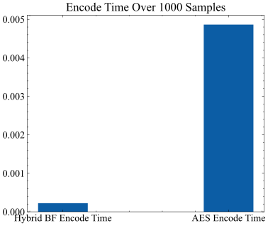

\pagebreak

# Algorithm Steps

## Encryption Process

The algorithm encrypts plaintext message using a polynomial and root finding method to generate a ciphertext. The encryption process works as follows:

1. Take the plaintext message and convert each 4 characters to an integer value using their ASCII values.
2. Take the key from the user which will be used to generate the polynomial. The encryption key consists of a set of 5 integer values $x_1$, $x_2$, $y$, $s$, and $r$.
   1. $x_1$ and $x_2$ define $x$ interval for the polynomial.
   2. $y$ defines the start of $y$ interval for the polynomial and the end will be the negative of $y$ to ensure that the polynomial crosses the x-axis and has a root.
   3. $s$ defines the number of sections that we want to divide the interval into which will affect the degree of the polynomial.
   4. $r$ is used as a random state for the random number generator. The random values will always be the same for the same $r$ value.
3. Use the encryption key to generate points that will be used to generate the polynomial. The points are generated using the following steps:
   1. Divide the interval $[x_1, x_2]$ into $s$ equal sections.
   2. Divide the interval $[y, -y]$ into $s$ equal sections.
   3. Generate points from the two intervals that will be used to generate the polynomial.
   4. Use the random numbers we got $r$ to add some noise to the points.
   5. Apply lagrange interpolation to the points to generate the polynomial.
4. Now we have the polynomial and the plaintext integer representation so we will subtract the plaintext integer from the polynomial representation
5. We get the root of the polynomial which will be the ciphertext using HybridBF algorithm which is a hybrid algorithm between the bisection method and false position method and it will be discussed later.

```{.mermaid caption="Encryption Steps Flowchart" width=25%}
graph TD
A[Start] --> B[Take plaintext message]
B --> C[Convert each 4 characters to an integer]
C --> D[Take the key from the user]
D --> E[Generate points using the key]
E --> F[Apply lagrange interpolation to the points]
F --> G[Subtract plaintext integer from polynomial]
G --> H[Find root of polynomial]
H --> I[End: Root is the Ciphertext]
```

## Decryption Process

The algorithm decrypts the ciphertext message using the polynomial. The decryption process works as follows:

1. Take the ciphertext and the key from the user which will be used to generate the polynomial again.
2. Use the key to generate the polynomial using the same steps as the encryption process.
3. Now we have the polynomial and the ciphertext so we will substitute the ciphertext in the polynomial to get the plaintext integer representation.
4. Convert the integer representation to the plaintext message by converting each integer to 4 characters using their ASCII values.

```{.mermaid caption="Decryption Steps Flowchart" width=45%}
graph TD
A[Start] --> B[Take ciphertext and key from user]
B --> C[Generate polynomial using the key]
C --> D[Substitute ciphertext in polynomial and get the result]
D --> E[The result is the plaintext integer representation]
E --> F[Convert the integer to the plaintext message]
F --> G[End: Plaintext message]
```

## HybridBF Algorithm

The HybridBF algorithm is a hybrid algorithm between the bisection method and false position method. The algorithm works as follows:

1. Take the polynomial and the interval that contains the root.
2. In each iteration, the algorithm will apply the bisection method and the false position method and get the root from each method.
3. The algorithm will choose the root that will give the smallest absolute value of the polynomial.
4. The algorithm will stop when the absolute value of the polynomial is less than a certain threshold we define.

```{.mermaid caption="HybridBF Steps Flowchart" width=35%}
graph TB
    Start(Start) --> Input[Input: Polynomial, Interval]
    Input --> Bisection[Apply Bisection Method]
    Input --> FalsePosition[Apply False Position Method]
    Bisection --> RootBisection[Root from Bisection]
    FalsePosition --> RootFalsePosition[Root from False Position]
    RootBisection --> Compare[Compare Absolute Values]
    RootFalsePosition --> Compare
    Compare --> Output[Output: Root with Smallest Absolute Value]
    Output --> Check{Check: Absolute Value < Threshold?}
    Check -- Yes --> End(End)
    Check -- No --> Input
```

# Results

The algorithm was tested using 1000 different plaintext messages and keys and was compared against AES encryption algorithm which is a symmetric encryption algorithm. The results showed that the algorithm is much faster than AES.

## Encode Time Comparison

The algorithm showed a significant improvement in the encoding time compared to AES. The encoding time was measured using the time library in python and the results are shown in this figure:


And when we sum the encoding time for all the 1000 messages we get the following results:

{width=350px}

## Decode Time Comparison

The algorithm have also showed a significant improvement in the decoding time compared to AES. The results are shown in this figure:


And when we sum the decoding time for all the 1000 messages we get the following results:

{width=350px}

## Total Time Comparison

The total time for both algorithms was also measured and compared. The results are shown in this figure:


And when we sum the total time for all the 1000 messages we get the following results:

{width=350px}
