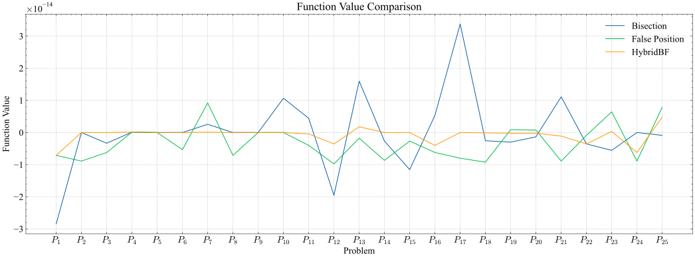
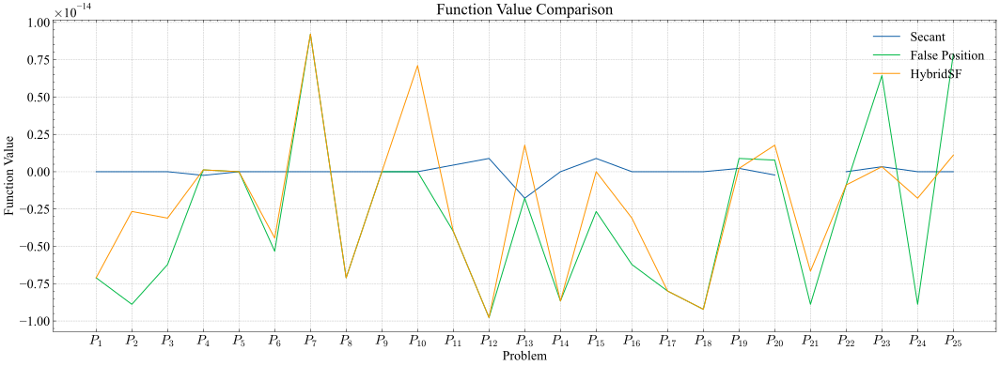
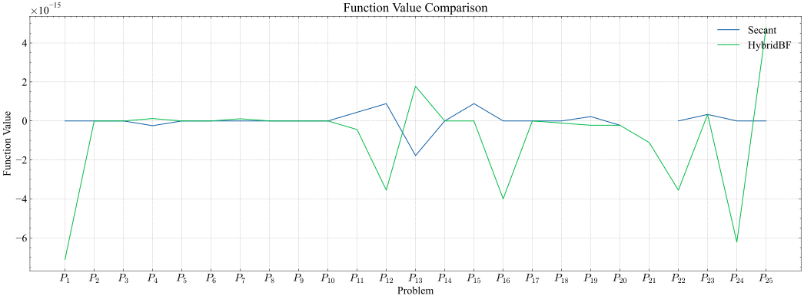

\pagebreak

### Conclusion

These are our conclusions based on the tables and the plots:

#### Iterations

##### Bisection, False Position, HybridBF

As you see in the plot below the HybridBF method demonstrates superior performance compared to both the bisection and false position methods in terms of the number of iterations required.

As we see here in $P_{21}$ the false position method have much more number of iterations than both hybrid and bisection methods which will lead to more CPU time as we will see in the next section.

##### Secant, False Position, HybridSF

The HybridSF method here didn't have the same performance improvement as in the previous case. The secant method is the fastest in terms of iterations, followed by the hybrid method then false position, However There are 7 problems where the HybridSF method is faster than the secant method with 1 or 2 iterations, these are $P_{4}$, $P_{5}$, $P_{7}$, $P_{9}$, $P_{18}$, $P_{19}$, $P_{20}$.

You can also notice that the graph of the secant method is not continuous on $P_{21}$ since secant method is not guaranteed to converge, so it wasn't able to find the root in this problem.

#### CPU Time

##### Bisection, False Position, HybridBF

As a result of having less number of iterations the hybridBF method shows significant improvement over the bisection method in terms of CPU time, with a ratio of 21:4. This translates to approximately 84% for the hybrid method and 16% for the bisection method.

It also shows an improvement over the false position method in terms of CPU time, with a ratio of 19:6. This translates to approximately 76% for the hybrid method and 24% for the false position method.

As a general trend, the hybrid method is faster than both the bisection and false position methods when it comes to finding the approximate root.

##### Secant, False Position, HybridSF

As a result of secant method having less number of iterations than both HybridSF and false position and much more simple implementation than HybridSF, it has less CPU time. The secant method is the fastest in terms of CPU time, followed by the hybrid method then false position.

This happens in all problems except only two problems which are $P_5$, $P_9$ where the HybridSF method is *slightly* faster than the secant method.

#### Function Value

##### Bisection, False Position, HybridBF

The hybrid method outperforms both the bisection and false position methods in terms of function value, with smaller absolute values that are closer to zero.

This happens in all problems except only one problem $P_{24}$ in which the bisection method had the nearest value to zero.

##### Secant, False Position, HybridSF

Again the secant method shows an improvement over both the false position and HybridSF methods in terms of function value, with smaller absolute values that are closer to zero.

This happens in all problems except two $P_4$ in which both HybridSF and false position methods had the nearest value to zero, and $P_{15}$ in which the HybridSF had a value closer to zero.

#### Secant vs HybridBF

When comparing the results of the fastest two algorithms which are the secant and HybridBF methods, we found the following:

##### Iterations

There is no winner here, the secant method is faster in some problems and the HybridBF method is faster in others but there is a slight advantage for the HybridSF method over the secant method.

##### CPU Time

When comparing the CPU time of both algorithms we found that the secant method is faster in all problems except for 6 problems which are $P_{2}$, $P_{5}$, $P_{6}$, $P_{8}$, $P_{9}$, $P_{14}$.

##### Function Value

When comparing function values with absolute values closer to zero, the results of secant method were better than the HybridBF method in nearly all problems except for $P_{15}$.

\begin{box4}{Used Machine Specifications}
The results were taken on a machine with the following specifications:
\begin{itemize}
    \item Operating System: Linux Mint 21.3 Cinnamon
    \item Processor: Intel© Core™ i5-8300H CPU @ 2.30GHz × 4
    \item Memory: 16GB
    \item Python Version: 3.11.6
\end{itemize}
\end{box4}
