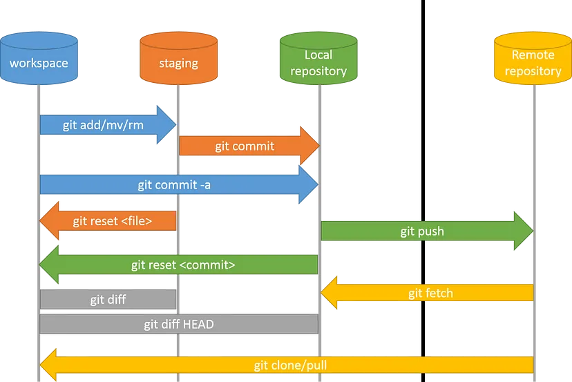

::: {.columns}

# Application Features

## Basic Features

- Products
- Cart
- Checkout
- Categories
- Orders
- Payment
- Ratings

- Inventory
- Vendors
- Brands
- Product Attributes
- Offers

## AI Features

- **Personalized Recommendations**
- Chat Bot

## Web Accessibility

- Better support for screen readers

# Extensions

- `ms-vsliveshare.vsliveshare`
- `CoenraadS.bracket-pair-colorizer-2`
- `ms-python.autopep8`
- `formulahendry.code-runner`
- `streetsidesoftware.code-spell-checker`
- `yzhang.dictionary-completion`
- `shd101wyy.markdown-preview-enhanced`
- `yzhang.markdown-all-in-one`
- `DavidAnson.vscode-markdownlint`
- `hediet.vscode-drawio`
- `dbaeumer.vscode-eslint`
- `eamodio.gitlens`
- `ecmel.vscode-html-css`
- `oderwat.indent-rainbow`
- `xabikos.JavaScriptSnippets`
- `ms-toolsai.jupyter`
- `ms-vscode.live-server`
- `PKief.material-icon-theme`
- `mushan.vscode-paste-image`
- `esbenp.prettier-vscode`
- `ms-python.python`
- `frhtylcn.pythonsnippets`
- `WallabyJs.quokka-vscode`
- `tldraw-org.tldraw-vscode`

# Later Discussion

- IntelliCode
- Mermaid & PlantUML
- Arabic language support

:::

---

# What is Git & Github

Git is a VCS (Version Control System) that allows us to track changes in our code over time. It also allows us to collaborate with other developers by merging our code together.

GitHub is a website that hosts Git repositories.

{width=450px}

## Some Git Configurations & Aliases

To open git settings `git config --global --edit` it will open in VSCode

Then add:

```
[init]
  defaultBranch = main
[color]
  ui = auto
[pull]
  rebase = false
[alias]
  br = branch --format='%(HEAD) %(color:yellow)%(refname:short)%(color:reset) -
   %(contents:subject) %(color:green)(%(committerdate:relative)) [%(authorname)]' 
   --sort=-committerdate

  p = push
  st = status
  a = add
  gl = config --global -l
  se = !git rev-list --all | xargs git grep -F
  d = diff
  dv = difftool -t vimdiff -y
  rv = remote -v
  ct = commit -m
  co = checkout
  m = merge
  cob = checkout -b

  ll = log --pretty=format:'%C(yellow)%h %ad%Cred%d | %Creset%s%Cblue 
  [%cn]' --decorate --date=short --graph

  cl = clone
  last = log -1 HEAD --stat
  undo = reset HEAD~1 --mixed
  redo = reset HEAD@{1} --soft
  tt = tree
  po = push origin
  del = branch -d
  delr = push origin --delete
  gal = config --get-regexp ^alias
```

Add `set-alias -name g -value git` to `notepad $profile`
