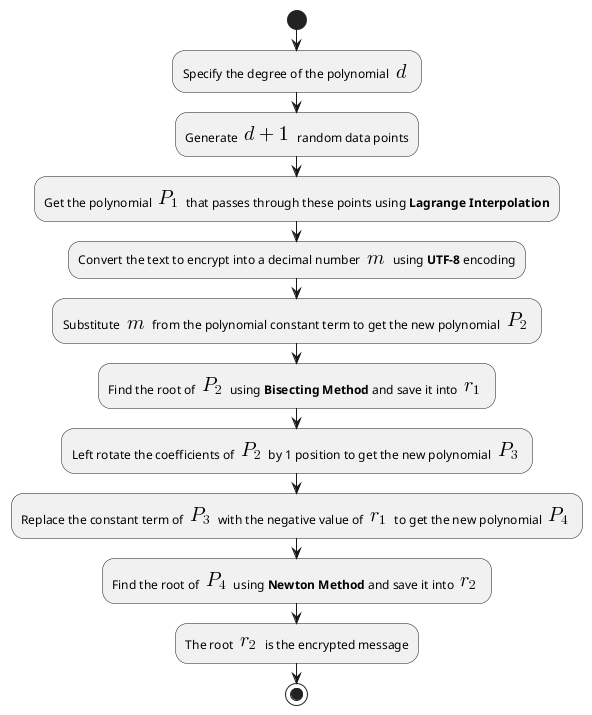

# Bi-New Algorithm Steps

## Encryption Process

1. Specify the degree of the polynomial $d$ that will be used as a shared key between the two parties. It should be an odd degree till 13^th^ order

2. Generate $d+1$ random data points.

3. Get the polynomial $P_1$ that passes through these points using **Lagrange Interpolation**.

4. Convert the text you want to encrypt into a decimal number $m$ using **UTF-8** encoding.

5. Substitute $m$ from the polynomial constant term to get the new polynomial. So for example if the polynomial is $P_1(x)=x^2+3x+5$ and $m=10$ then the new polynomial will be $P_2(x)=x^2+3x-5$.

6. Find the root of $P_2$ using **Bisecting Method** and save it into $r_1$.

7. Now left rotate (Circular Rotation) the coefficients of $P_2$ by 1 position so if $P_2$ is $x^2+3x-5$ then the new polynomial will be $P_3(x)=3x^2-5x+1$.

8. Now replace the constant term of $P_3$ with the negative value of $r_1$ to get the new polynomial $P_4$. So for example if $P_3(x)=3x^2-5x+1$ and $r_1=4$ then $P_4(x)=3x^2-5x-4$.

9. Finally find the root of $P_4$ using **Newton Method** and save it into $r_2$.

10. The root $r_2$ will be the encrypted message that will be sent to the receiver.

<!-- ## Decryption Process -->

# UTF-8 & ASCII Encoding

UTF-8 is a variable-length character encoding standard used for electronic communication. Defined by the Unicode Standard, the name is derived from Unicode Transformation Format – 8-bit. *Variable-length* character encoding means that different characters can take up a different number of bytes. In the context of UTF-8, it means that a single character can be represented using anywhere from 1 to 4 bytes.

For example, standard ASCII characters (like 'a', 'b', '1', etc.) only require 1 byte in UTF-8. However, other characters, such as many emoji, accented letters, and characters from non-Latin scripts, require more bytes. This flexibility allows UTF-8 to efficiently represent the wide range of characters defined in the Unicode standard, while maintaining backward compatibility with ASCII.

In UTF-8 encoding, a character is not always 1 byte. It can be anywhere from 1 to 4 bytes depending on the specific character. This is what allows UTF-8 to represent a wide range of characters from various languages and symbol sets, including those outside the ASCII range.

ASCII is limited compared to UTF-8 ASCII character encoding uses 7 bits for each character. This means that it can only represent 128 characters (2^7^ = 128) These characters include the English alphabet (in both upper and lower cases), digits, punctuation marks, and control characters. The first 128 characters in Unicode are the same as ASCII, so UTF-8 is backwards compatible with ASCII. This means that any ASCII text is also valid UTF-8 text.

However, ASCII is often stored in 8-bit bytes for convenience, with the extra bit typically used as a parity bit for error checking in some systems, or left as 0 in systems that don't require error checking. This 8-bit version is often referred to as "extended ASCII" or "ASCII-8", but it's not a standard and the extra bit's usage can vary between systems.

# Some Notes

The changes we will make to the algorithm will include replacing both bisection and newton methods with the hybrid method to achieve a faster performance.

We may also (still not sure) do the following:

1. Use another algorithm faster than Lagrange Interpolation to find the polynomial. Newton Interpolation is a good candidate.

2. Use a changing number of rotations agreed upon by both parties instead of just 1 rotation. The number of rotations will not exceed the degree of the polynomial as we rotate in a circular way so it's just useless to rotate more than the degree of the polynomial, one way to ensure this is to use mod % operation.

<!-- 
TODO Ask BingChat:

Is there any wrong info here

paraphrase 

Make Flow Chart for decryption process
-->

<!-- 
Encryption Flowchart

-->
