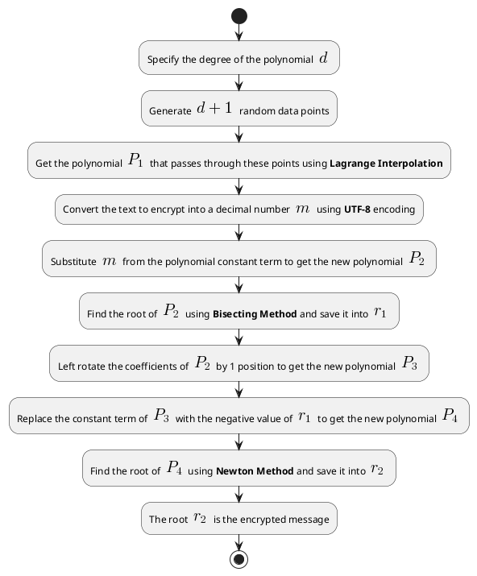

# IBGA.md

<!-- 
Encryption Flowchart


-->

=============================================================

::: {.columns .ragged columngap=2.5em column-rule="0.0pt solid black"}

```{.mermaid}
graph TB
    E1[Specify degree <br> d of polynomial]
    E2{Degree <br> 1 ≤ d ≤ 10?}
    E3[Generate d+1 <br> random data points]
    E4[Get polynomial P_1 <br> using Lagrange <br> Interpolation]
    E5[Convert text to <br> decimal number t <br> using UTF-8]
    E6[Subtract t from <br> P_1 constant term <br> to get P_2]
    E7{10 ≤ d ≤ 15?}
    E8[Get Nth root of <br> constant term <br> where N = degree/2]
    E9[Get Nth root of <br> constant term <br> where N = degree/3]
    E10[Get Nth root of <br> constant term <br> where N = degree]
    E11[Use Nth root to get <br> initial guesses for <br> root finding method]
    E12[Find root r of <br> P_2 using root <br> finding method]
    E13[Send root r as <br> encrypted message]
    
    E1-->E2
    E2-- Yes -->E8
    E2-- No -->E7
    E7-- Yes -->E9
    E7-- No -->E10
    E3-->E4-->E5-->E6-->E11
    E8-->E11
    E9-->E11
    E10-->E11
    E11-->E12-->E13

```

\columnbreak

```{.plantuml}
@startuml
title Encryption Process

start

:Specify degree d of polynomial;
if (Degree 1 ≤ d ≤ 10?) then (yes)
  :Get Nth root of constant term where N = degree/2;
else (no)
  if (10 ≤ d ≤ 15?) then (yes)
    :Get Nth root of constant term where N = degree/3;
  else (no)
    :Get Nth root of constant term where N = degree;
  endif
endif

:Generate d+1 random data points;
:Get polynomial P_1 using Lagrange Interpolation;
:Convert text to decimal number t using UTF-8;
:Subtract t from P_1 constant term to get P_2;
:Use Nth root to get initial guesses for root finding method;
:Find root r of P_2 using root finding method;
:Send root r as encrypted message;

stop
@enduml
```

:::

# Some Notes

The changes we will make to the algorithm will include replacing both bisection and newton methods with the hybrid method to achieve a faster performance.

We may also (still not sure) do the following:

1. Use another algorithm faster than Lagrange Interpolation to find the polynomial. Newton Interpolation is a good candidate.

2. Use a changing number of rotations agreed upon by both parties instead of just 1 rotation. The number of rotations will not exceed the degree of the polynomial as we rotate in a circular way so it's just useless to rotate more than the degree of the polynomial, one way to ensure this is to use mod % operation.
