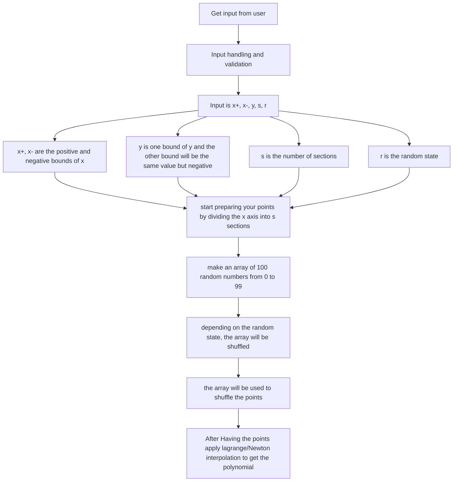

# Meeting

Messaging Application and the messages are encrypted using our own encryption algorithm.

Normalization Formula

$$
\begin{aligned}
\text{Normalized Value} &= \frac{\text{Value} - \text{Min}}{\text{Max} - \text{Min}} \\
\text{Value} &= \text{Normalized Value} \times (\text{Max} - \text{Min}) + \text{min} \\
\end{aligned}
$$

# Algorithm Steps

1. Get input from user
2. Input handling and validation
3. Input is $x_{1}$, $x_{2}$, $y$, $s$, $r$
   1. $x_{1}$, $x_{2}$ are the positive and negative bounds of $x$
   2. $y$ is one bound of $y$ and the other bound will be the same value but negative.
   3. $s$ is the number of sections
   4. $r$ is the ramdom state
4. start preparing your points by dividing the $x$ axis into $s$ sections
5. make an array of 100 random numbers from 0 to 99.
6. depending on the random state, the array will be shuffled.
7. the array will be used to shuffle the points.
8. After Having the points apply lagrange/Newton interpolation to get the polynomial.

