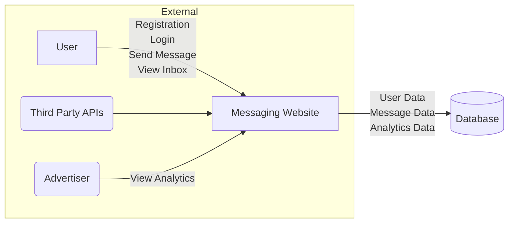
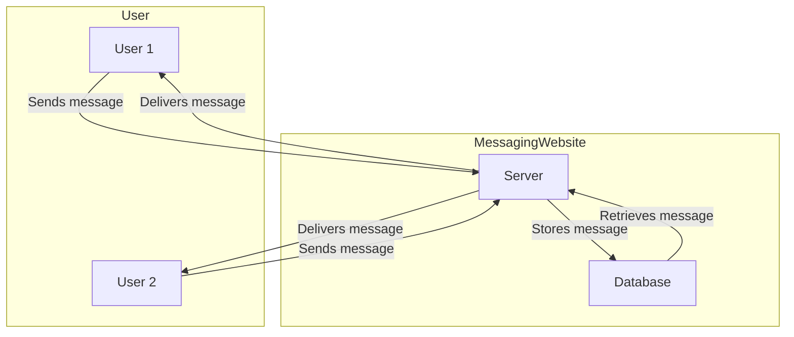

# Meeting

Messaging Application and the messages are encrypted using our own encryption algorithm.

Normalization Formula

$$
\begin{aligned}
\text{Normalized Value} &= \frac{\text{Value} - \text{Min}}{\text{Max} - \text{Min}} \\
\text{Value} &= \text{Normalized Value} \times (\text{Max} - \text{Min}) + \text{min} \\
\end{aligned}
$$

# Algorithm Steps

1. Get input from user
2. Input handling and validation
3. Input is $x_{1}$, $x_{2}$, $y$, $s$, $r$
   1. $x_{1}$, $x_{2}$ are the positive and negative bounds of $x$
   2. $y$ is one bound of $y$ and the other bound will be the same value but negative.
   3. $s$ is the number of sections
   4. $r$ is the ramdom state
4. start preparing your points by dividing the $x$ axis into $s$ sections
5. make an array of 100 random numbers from 0 to 99.
6. depending on the random state, the array will be shuffled.
7. the array will be used to shuffle the points.
8. After Having the points apply lagrange/Newton interpolation to get the polynomial.

```{.mermaid caption="Algorithm Steps" width=60%}
graph TD
  A[Get input from user] --> B[Input handling and validation]
  B --> C[Input is x+, x-, y, s, r]
  C --> D1[x+, x- are the positive and negative bounds of x]
  C --> D2[y is one bound of y and the other bound will be the same value but negative]
  C --> D3[s is the number of sections]
  C --> D4[r is the random state]
  D1 --> E[start preparing your points by dividing the x axis into s sections]
  D2 --> E
  D3 --> E
  D4 --> E
  E --> F[make an array of 100 random numbers from 0 to 99]
  F --> G[depending on the random state, the array will be shuffled]
  G --> H[the array will be used to shuffle the points]
  H --> I[After Having the points apply lagrange/Newton interpolation to get the polynomial]
```

# Diagrams

Diagrams to be used in our project.

1. Use Case Diagram (Sara)
2. Activity Diagram (Abdelfattah)
3. DFD & Context Diagram (Dalia)
4. Class Diagram & State Diagram (Shrouk)
5. ERD (Mohamed Emary)
6. Sequence Diagram (Mohamed Abdelfattah)

```{.plantuml caption="Sample Use Case" width=30%}
@startuml
left to right direction
actor User
actor Admin

rectangle "Messaging Website" {
    User --> (Login)
    User --> (Logout)
    User --> (Send Message)
    User --> (Read Message)
    User --> (Delete Message)
    User --> (Search Message)
    User --> (Create Group Chat)
    User --> (Join Group Chat)
    User --> (Leave Group Chat)
    User --> (Send Message in Group Chat)
    User --> (Read Message in Group Chat)

    (Send Message) .> (Upload Attachment) : includes
    (Read Message) .> (Download Attachment) : includes
    (Send Message in Group Chat) .> (Upload Attachment) : includes
    (Read Message in Group Chat) .> (Download Attachment) : includes

    Admin --> (Login)
    Admin --> (Logout)
    Admin --> (Delete User)
    Admin --> (Delete Message)
    Admin --> (Delete Group Chat)
}
@enduml
```

## Use Case Diagram

**What normal user can do:**

1. Sign Up
2. Login
3. Send Text Message
4. Send Images
5. Search For Messages
6. Delete Messages
7. Read Message in Group Chat
8. Change Profile Picture
9. Update Profile Information (Name, Email, Password)
10. Edit Messages
11. Logout

**What admin can do:**

1. Sign Up
2. Login
3. Ban/Unban Users
4. Delete Users
5. Delete Messages
6. Update Application Content
7. View System Statistics in a Dashboard
8. Logout

## Initial Use Case Diagram




