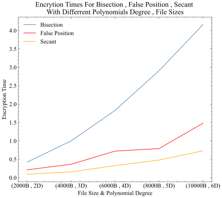

We have used 3 root finding methods to encrypt, and decrypt our data with different length and the secant method was the fastest. Bisection method was the slowest. The results are shown in the following image.

Encryption time for each algorithm is shown in the following image.

{width=400px}

Decryption time for each algorithm is shown in the following image.

{width=400px}

Total time for each algorithm is shown in the following image.

{width=400px}

# AES vs Encryption Algorithm Secant Method

The following image shows the comparison between AES and the Secant method.

{width=400px}

{width=400px}

{width=400px}

{width=400px}

# Different File Size With The Same Polynomial Degree

The following image shows the comparison between different file sizes with the same polynomial degree.

{width=400px}

{width=400px}

{width=400px}

{width=400px}
