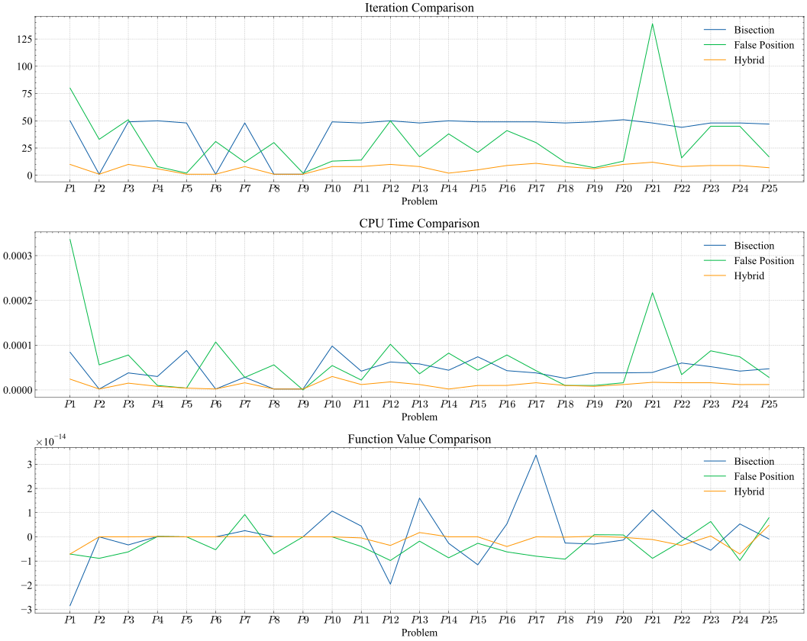

<!-- 
TODO:
  1. Make the table span pages instead of having each table in a separate page
-->

\pagebreak

# Equations

We have used the same 25 equations with each method and run each method (Bisection, False Position, and Hybrid) 500 times for each problem and then we have calculated the average time. We have also calculated the number of iterations each method have taken for each problem.

We have also used the same tolerance for each method which is $10^{-14}$

These are the equations that we have used with each method:

## Our Equations

In these equations we have tried to use different types of functions and intervals to test our methods.

Table: Our Equations Table

|  No   | Equation                   | Equation Code                       | Interval       |
| :---: | :------------------------- | :---------------------------------- | :------------- |
| $P1$  | $f(x) = x^{3}+4x^{2}-10=0$ | `x**3 + 4*x**2 - 10`                | `[0, 4]`       |
| $P2$  | $f(x)=x^2-4$               | `x**2 - 4`                          | `[0, 4]`       |
| $P3$  | $f(x)=e^x-2$               | `math.exp(x) - 2`                   | `[0, 2]`       |
| $P4$  | $f(x)=\sin(x)$             | `math.sin(x)`                       | `[2, 6]`       |
| $P5$  | $f(x)=x^3-6x^2+11x-6$      | `x**3 - 6*x**2 + 11*x - 6`          | `[1, 2.5]`     |
| $P6$  | $f(x)=x^2+3x+2$            | `x**2 + 3*x + 2`                    | `[-2.5, -1.5]` |
| $P7$  | $f(x)=\cos(x)-x$           | `math.cos(x) - x`                   | `[0, 1]`       |
| $P8$  | $f(x)=2^x-8$               | `2**x - 8`                          | `[2,4]`        |
| $P9$  | $f(x)=\tan(x)$             | `math.tan(x)`                       | `[-1, 1]`      |
| $P10$ | $f(x)=x^4-8x^3+18x^2-9x+1$ | `x**4 - 8*x**3 + 18*x**2 - 9*x + 1` | `[2, 4]`       |

## Equations From Paper

We got these equations from [this paper](https://www.researchgate.net/publication/360883886_Novel_hybrid_algorithms_for_root_determining_using_advantages_of_open_methods_and_bracketing_methods) and we have used the same intervals too.

Table: Equations From Paper Table

|  No   | Equation                 | Equation Code                    | Interval  | Reference       |
| :---: | :----------------------- | :------------------------------- | :-------- | :-------------- |
| $P11$ | $f(x)=x^2-3$             | `x**2 - 3`                       | `[1,2]`   | Harder [18]     |
| $P12$ | $f(x)=x^2-5$             | `x**2 - 5`                       | `[2,7]`   | Srivastava[9]   |
| $P13$ | $f(x)=x^2-10$            | `x**2 - 10`                      | `[3,4]`   | Harder [18]     |
| $P14$ | $f(x)=x^2-x-2$           | `x**2 - x - 2`                   | `[1,4]`   | Moazzam [10]    |
| $P15$ | $f(x)=x^2+2x-7$          | `x**2 + 2*x - 7`                 | `[1,3]`   | Nayak[11]       |
| $P16$ | $f(x)=x^3-2$             | `x**3 - 2`                       | `[0,2]`   | Harder [18]     |
| $P17$ | $f(x)=xe^x-7$            | `x * math.exp(x) - 7`            | `[0,2]`   | Callhoun [19]   |
| $P18$ | $f(x)=x-\cos(x)$         | `x - math.cos(x)`                | `[0,1]`   | Ehiwario [6]    |
| $P19$ | $f(x)=x\sin(x)-1$        | `x * math.sin(x) - 1`            | `[0,2]`   | Mathews [20]    |
| $P20$ | $f(x)=x\cos(x)+1$        | `x * math.cos(x) + 1`            | `[-2,4]`  | Esfandiari [21] |
| $P21$ | $f(x)=x^{10}-1$          | `x**10 - 1`                      | `[0,1.3]` | Chapra [17]     |
| $P22$ | $f(x)=x^2+e^{x/2}-5$     | `x**2 + (2.71828**(x/2)) - 5`    | `[1,2]`   | Esfandiari [21] |
| $P23$ | $f(x)=\sin(x)\sinh(x)+1$ | `math.sin(x) * math.sinh(x) + 1` | `[3,4]`   | Esfandiari [21] |
| $P24$ | $f(x)=e^x-3x-2$          | `(2.71828**x) - 3*x - 2`         | `[2,3]`   | Hoffman [22]    |
| $P25$ | $f(x)=\sin(x)-x^2$       | `math.sin(x) - x**2`             | `[0.5,1]` | Chapra[17]      |

# Results

These are the results we got with each method. We have run each method 500 times on each equation and took the average time to get the highest accuracy possible.

## False Position

These are the results we got with False Position method:

<!-- \fontsize{5}{12}\selectfont -->
\begin{scriptsize}
\begin{longtable}{ccccccc}
    \caption{False Position Table} \\
    \toprule
    \multirow{2}[4]{*}{\textbf{Problem}} & \multicolumn{6}{c}{\textbf{Bisection Algorithm}} \\
    \cmidrule{2-7}
    & \textbf{Iter} & \textbf{Avg CPU Time} & \textbf{Approximate Root} & \textbf{Function Value} & \textbf{Lower Bound} & \textbf{Upper Bound} \\
    \midrule
    \endfirsthead
    \toprule
    \multirow{2}[4]{*}{\textbf{Problem}} & \multicolumn{6}{c}{\textbf{Bisection Algorithm}} \\
    \cmidrule{2-7}
    & \textbf{Iter} & \textbf{Avg CPU Time} & \textbf{Approximate Root} & \textbf{Function Value} & \textbf{Lower Bound} & \textbf{Upper Bound} \\
    \midrule
    \endhead
    \hline
    \endfoot
    \bottomrule
    \endlastfoot
    $P1$ & 80     & 0.000229008 & 1.3652300134140964 & -7.11E-15 & 1.3652300134140964 & 4 \\
    $P2$ & 33     & 4.399728775024414e-05 & 1.9999999999999978 & -8.88E-15 & 1.9999999999999978 & 4 \\
    $P3$ & 51     & 5.6000232696533204e-05 & 0.6931471805599422 & -6.22E-15 & 0.6931471805599422 & 2 \\
    $P4$ & 8      & 6.000041961669922e-06 & 3.141592653589793 & 1.2246467991473532e-16 & 3.141592653589793 & 3.1415926535899232 \\
    $P5$ & 2      & 0      & 1      & 0      & 1      & 2.5 \\
    $P6$ & 31     & 4.800844192504883e-05 & -2     & -5.33E-15 & -2.5   & -2 \\
    $P7$ & 12     & 1.101541519165039e-05 & 0.7390851332151551 & 9.2148511043888e-15 & 0.7390851332151551 & 1 \\
    $P8$ & 30     & 4.401159286499024e-05 & 2.9999999999999987 & -7.11E-15 & 2.9999999999999987 & 4 \\
    $P9$ & 2      & 1.991748809814453e-06 & 0      & 0      & 0      & 1 \\
    $P10$ & 13     & 4.0007591247558594e-05 & 3.1117486563092474 & 0      & 3.1117486563092474 & 3.1117486563092482 \\
    \hline
    $P11$ & 14     & 1.7997264862060548e-05 & 1.732050807568876 & -4.00E-15 & 1.732050807568876 & 2 \\
    $P12$ & 50     & 6.600427627563476e-05 & 2.2360679774997876 & -9.77E-15 & 2.2360679774997876 & 7 \\
    $P13$ & 17     & 2.2464752197265626e-05 & 3.162277660168379 & -1.78E-15 & 3.162277660168379 & 4 \\
    $P14$ & 38     & 5.301380157470703e-05 & 1.9999999999999971 & -8.66E-15 & 1.9999999999999971 & 4 \\
    $P15$ & 21     & 3.1998634338378904e-05 & 1.8284271247461896 & -2.66E-15 & 1.8284271247461896 & 3 \\
    $P16$ & 41     & 5.600643157958984e-05 & 1.2599210498948719 & -6.22E-15 & 1.2599210498948719 & 2 \\
    $P17$ & 30     & 3.40123176574707e-05 & 1.5243452049841437 & -7.99E-15 & 1.5243452049841437 & 2 \\
    $P18$ & 12     & 1.2005805969238282e-05 & 0.7390851332151551 & -9.21E-15 & 0.7390851332151551 & 1 \\
    $P19$ & 7      & 7.99846649169922e-06 & 1.1141571408719306 & 8.881784197001252e-16 & 1.0997501702946164 & 1.1141571408719306 \\
    $P20$ & 13     & 1.1332988739013672e-05 & 2.0739328090912146 & 7.771561172376096e-16 & 2.0739328090912146 & 2.5157197710146586 \\
    $P21$ & 139    & 0.000183961 & 0.9999999999999991 & -8.88E-15 & 0.9999999999999991 & 1.3 \\
    $P22$ & 16     & 3.3281803131103514e-05 & 1.6490135532979475 & -1.78E-15 & 1.6490135532979475 & 2 \\
    $P23$ & 45     & 7.994651794433594e-05 & 3.2215883990939416 & 6.328271240363392e-15 & 3.2215883990939416 & 4 \\
    $P24$ & 45     & 6.818151473999023e-05 & 2.1253934262332246 & -9.77E-15 & 2.1253934262332246 & 3 \\
    $P25$ & 17     & 2.703714370727539e-05 & 0.8767262153950554 & 7.882583474838611e-15 & 0.8767262153950554 & 1 \\
\end{longtable}
\end{scriptsize}

## Bisection Method

These are the results we got with Bisection method:

\begin{scriptsize}
\begin{longtable}{ccccccc}
    \caption{Bisection Table} \label{tab:addlabel} \\
    \toprule
    \multirow{2}[4]{*}{\textbf{Problem}} & \multicolumn{6}{c}{\textbf{Bisection Algorithm}} \\
    \cmidrule{2-7}
    & \textbf{Iter} & \textbf{Avg CPU Time} & \textbf{Approximate Root} & \textbf{Function Value} & \textbf{Lower Bound} & \textbf{Upper Bound} \\
    \midrule
    \endfirsthead
    \toprule
    \multirow{2}[4]{*}{\textbf{Problem}} & \multicolumn{6}{c}{\textbf{Bisection Algorithm}} \\
    \cmidrule{2-7}
    & \textbf{Iter} & \textbf{Avg CPU Time} & \textbf{Approximate Root} & \textbf{Function Value} & \textbf{Lower Bound} & \textbf{Upper Bound} \\
    \midrule
    \endhead
    \hline
    \endfoot
    \bottomrule
    \endlastfoot
    $P1$  & 50     & 7.303380966186524e-05 & 1.3652300134140951 & -2.84E-14 & 1.3652300134140916 & 1.3652300134140987 \\
    $P2$  & 1      & 0      & 2      & 0      & 0      & 4 \\
    $P3$  & 49     & 4.200363159179687e-05 & 0.6931471805599436 & -3.33E-15 & 0.6931471805599401 & 0.6931471805599472 \\
    $P4$  & 50     & 3.406333923339844e-05 & 3.141592653589793 & 1.2246467991473532e-16 & 3.1415926535897896 & 3.1415926535897967 \\
    $P5$  & 48     & 7.496118545532227e-05 & 2.0000000000000018 & 0      & 1.9999999999999964 & 2.000000000000007 \\
    $P6$  & 1      & 1.9011497497558594e-06 & -2     & 0      & -2.5   & -1.5 \\
    $P7$  & 48     & 3.201484680175781e-05 & 0.7390851332151591 & 2.55351295663786e-15 & 0.7390851332151556 & 0.7390851332151627 \\
    $P8$  & 1      & 1.9893646240234374e-06 & 3      & 0      & 2      & 4 \\
    $P9$  & 1      & 1.991748809814453e-06 & 0      & 0      & -1     & 1 \\
    $P10$ & 49     & 9.199857711791992e-05 & 3.111748656309249 & 1.0658141036401503e-14 & 3.1117486563092456 & 3.1117486563092527 \\
    \hline
    $P11$ & 48     & 4.000377655029297e-05 & 1.7320508075688785 & 4.440892098500626e-15 & 1.732050807568875 & 1.732050807568882 \\
    $P12$ & 50     & 3.901958465576172e-05 & 2.2360679774997854 & -1.95E-14 & 2.236067977499781 & 2.236067977 \\
    $P13$ & 48     & 3.7988662719726566e-05 & 3.1622776601683817 & 1.5987211554602254e-14 & 3.162277660168378 & 3.1622776601683853 \\
    $P14$ & 50     & 4.400014877319336e-05 & 1.9999999999999991 & -2.66E-15 & 1.9999999999999964 & 2.0000000000000018 \\
    $P15$ & 49     & 5.607509613037109e-05 & 1.828427124746188 & -1.15E-14 & 1.8284271247461845 & 1.8284271247461916 \\
    $P16$ & 49     & 3.8086414337158205e-05 & 1.2599210498948743 & 5.329070518200751e-15 & 1.2599210498948707 & 1.2599210498948779 \\
    $P17$ & 49     & 3.905820846557617e-05 & 1.5243452049841473 & 3.375077994860476e-14 & 1.5243452049841437 & 1.5243452049841508 \\
    $P18$ & 48     & 2.9998779296875e-05 & 0.7390851332151591 & -2.55E-15 & 0.7390851332151556 & 0.7390851332151627 \\
    $P19$ & 49     & 0.000136974 & 1.114157140871928 & -3.00E-15 & 1.1141571408719244 & 1.1141571408719315 \\
    $P20$ & 51     & 5.606412887573242e-05 & 2.0739328090912155 & -1.33E-15 & 2.073932809091213 & 2.073932809091218 \\
    $P21$ & 48     & 4.004716873168945e-05 & 1.000000000000001 & 1.1102230246251565e-14 & 0.9999999999999966 & 1.0000000000000058 \\
    $P22$ & 44     & 5.988311767578125e-05 & 1.649013553297948 & 0      & 1.6490135532978911 & 1.6490135532980048 \\
    $P23$ & 48     & 6.889772415161133e-05 & 3.2215883990939425 & -5.55E-15 & 3.221588399093939 & 3.221588399093946 \\
    $P24$ & 48     & 4.5994281768798825e-05 & 2.1253934262332272 & 5.329070518200751e-15 & 2.1253934262332237 & 2.125393426233231 \\
    $P25$ & 47     & 6.799602508544923e-05 & 0.8767262153950632 & -8.88E-16 & 0.8767262153950597 & 0.8767262153950668 \\
\end{longtable}
\end{scriptsize}

## Hybrid Method

These are the results we got with hybrid method:

\begin{scriptsize}
\begin{longtable}{ccccccc}
    \caption{Hybrid Table} \\
    \toprule
    \multirow{2}[4]{*}{\textbf{Problem}} & \multicolumn{6}{c}{\textbf{Bisection Algorithm}} \\
    \cmidrule{2-7}
    & \textbf{Iter} & \textbf{Avg CPU Time} & \textbf{Approximate Root} & \textbf{Function Value} & \textbf{Lower Bound} & \textbf{Upper Bound} \\
    \midrule
    \endfirsthead % This marks the end of the header for the first page
    \toprule
    \multirow{2}[4]{*}{\textbf{Problem}} & \multicolumn{6}{c}{\textbf{Bisection Algorithm}} \\
    \cmidrule{2-7}
    & \textbf{Iter} & \textbf{Avg CPU Time} & \textbf{Approximate Root} & \textbf{Function Value} & \textbf{Lower Bound} & \textbf{Upper Bound} \\
    \midrule
    \endhead % This marks the end of the header for the subsequent pages
    \hline
    \endfoot % This marks the end of the footer for the intermediate pages
    \bottomrule
    \endlastfoot % This marks the end of the footer for the last page
    $P1$ & 10     & 3.6006927490234375e-05 & 1.3652300134140964 & -7.11E-15 & 1.365230013413779 & 1.3675001980274413 \\
    $P2$ & 1      & 1.9969940185546874e-06 & 2      & 0      & 0      & 4 \\
    $P3$ & 10     & 1.399993896484375e-05 & 0.6931471805599453 & 0      & 0.6931471805599334 & 0.695162706 \\
    $P4$ & 6      & 1.006174087524414e-05 & 3.141592653589793 & 1.2246467991473532e-16 & 3.1415903579556947 & 3.141592653604888 \\
    $P5$ & 1      & 3.940105438232422e-06 & 1      & 0      & 1      & 2.5 \\
    $P6$ & 1      & 1.9888877868652345e-06 & -2     & 0      & -2.5   & -1.5 \\
    $P7$ & 8      & 1.1938095092773438e-05 & 0.7390851332151606 & 1.1102230246251565e-16 & 0.739085133 & 0.7422270732175922 \\
    $P8$ & 1      & 2.0036697387695312e-06 & 3      & 0      & 2      & 4 \\
    $P9$ & 1      & 2.0928382873535157e-06 & 0      & 0      & -1     & 1 \\
    $P10$ & 8      & 2.4066925048828126e-05 & 3.1117486563092474 & 0      & 3.1085379927858856 & 3.1117486563092536 \\
    \hline
    $P11$ & 8      & 1.7096519470214843e-05 & 1.7320508075688772 & -4.44E-16 & 1.7320508075688001 & 1.7350578402209837 \\
    $P12$ & 10     & 1.4061450958251953e-05 & 2.236067977499789 & -3.55E-15 & 2.236067977499364 & 2.243929153983615 \\
    $P13$ & 8      & 1.393747329711914e-05 & 3.1622776601683795 & 1.7763568394002505e-15 & 3.16227766 & 3.1672187190124017 \\
    $P14$ & 2      & 2.0089149475097657e-06 & 2      & 0      & 1.5    & 2.5 \\
    $P15$ & 5      & 8.056163787841797e-06 & 1.828427125 & 0      & 1.8284271247430004 & 1.8284271247493797 \\
    $P16$ & 9      & 1.2000083923339844e-05 & 1.2599210498948723 & -4.00E-15 & 1.259921049893984 & 1.2611286403176987 \\
    $P17$ & 11     & 1.3935565948486329e-05 & 1.5243452049841444 & 0      & 1.5243452049841386 & 1.526033337108763 \\
    $P18$ & 8      & 1.0064601898193359e-05 & 0.7390851332151606 & -1.11E-16 & 0.739085133 & 0.7422270732175922 \\
    $P19$ & 6      & 8.002758026123047e-06 & 1.1141571408719302 & 2.220446049250313e-16 & 1.1132427327642702 & 1.1141571408719768 \\
    $P20$ & 10     & 1.5938282012939452e-05 & 2.073932809091215 & -2.22E-16 & 2.0739328090911866 & 2.078935003337393 \\
    $P21$ & 12     & 1.6058921813964842e-05 & 0.9999999999999999 & -1.11E-15 & 0.9999999999999305 & 1.000343363282986 \\
    $P22$ & 8      & 2.393531799316406e-05 & 1.6490135532979473 & -3.55E-15 & 1.6490135532974015 & 1.6531560376633945 \\
    $P23$ & 9      & 1.7997264862060548e-05 & 3.221588399093942 & 3.3306690738754696e-16 & 3.2215883990939242 & 3.2224168881395068 \\
    $P24$ & 9      & 1.2019157409667969e-05 & 2.125393426233225 & -7.11E-15 & 2.1253934262325003 & 2.1275213330097245 \\
    $P25$ & 7      & 1.1998653411865234e-05 & 0.8767262153950581 & 4.773959005888173e-15 & 0.8767262153886713 & 0.8772684454348731 \\
\end{longtable}
\end{scriptsize}

As we see from the table above the hybrid method tend to be faster and take much less iterations than both Bisection and False Position methods.

\pagebreak

## Final Results

<!--  -->

### Iterations

### CPU Time

### Function Value

